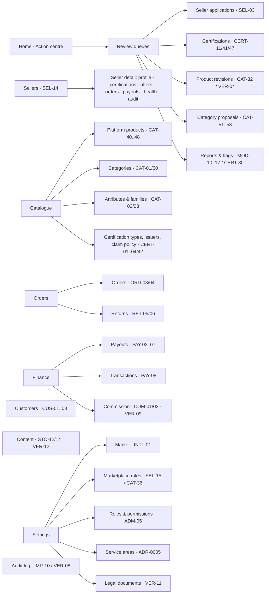
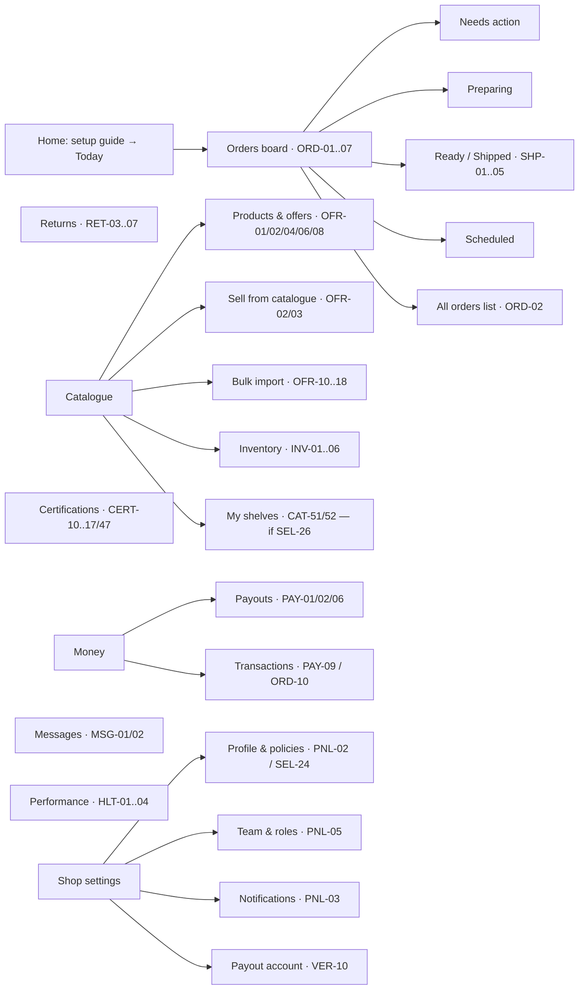

# پژوهش و استراتژی UX — پنل مدیریت (Admin) و پنل فروشنده (Vendor)

| | |
|---|---|
| **وضعیت** | پیش‌نویس برای بازبینی صاحب پروژه |
| **تاریخ** | ۱ اکتبر ۲۰۲۶ |
| **تهیه‌کننده** | رضا (ui-ux-designer) و جعفر (product-designer) |
| **بازبین‌ها** | هادی (product-owner)، علی (cto)، مهدی (frontend-developer)، حسن (security-tester) |
| **مسیر** | `docs/design/research/panels-ux-strategy.md` |
| **ورودی‌ها** | `docs/features/01..10`، ADR-0001..0013، پژوهش میدانی وب (فهرست منابع در انتها) |

> **نام‌گذاری:** «Vendor panel» در این سند همان «پنل فروشنده / Seller Panel» در فایل‌های features است (ماژول `sellers`، کدهای `PNL-*`). نام نهایی در رابط کاربری یک تصمیم باز است (D4).

---

## ۰. خلاصه برای صاحب پروژه

۱. **دو پنل، دو نوع کار متفاوت.** پنل مدیریت کارِ «بازبینی و نظارت» است (صف تأیید فروشنده، گواهی، محصول، مرجوعی، تسویه) و پشت میز با صفحهٔ بزرگ انجام می‌شود. پنل فروشنده کارِ «عملیات روزانهٔ مغازه» است (سفارش فوری، موجودی، گواهی) و بخش مهمی از آن روی تبلت/گوشی کنار پیشخوان انجام می‌شود.

۲. **صفحهٔ اول هر دو پنل «صف کارهای من» است، نه نمودار.** ادمین می‌بیند چه چیزی منتظر تأیید اوست و چقدر وقت دارد؛ فروشنده می‌بیند کدام سفارش همین الان اقدام لازم دارد.

۳. **اعتماد باید قابل ردیابی باشد.** هر تغییر وضعیت (تأیید، رد، تعلیق، انقضای گواهی، تسویه) در UI نشان می‌دهد چه کسی، کی و چرا — این مستقیماً از اصل تمایز ۵ و CERT-17/32 و IMP-10 می‌آید.

۴. **Market، ارز و منطقهٔ زمانی همیشه صریح.** حتی با یک Market (AU)، پوستهٔ پنل Market فعال را نشان می‌دهد و زمان‌ها با منطقهٔ زمانی طرف مالک (مثلاً فروشنده در بریزبین = AEST، UTC+10) نمایش داده می‌شوند (ADR-0002/0003/0005).

۵. **الگوها را از بهترین‌ها برمی‌داریم، کد و ظاهر را خودمان می‌سازیم.** Shopify Polaris و Atlassian فقط برای محصولات خودشان مجوز دارند؛ از آن‌ها «الگو» یاد می‌گیریم. پیشنهاد: اجزای پایهٔ بدون‌ظاهر و دسترس‌پذیر (React Aria یا shadcn/Base UI) + توکن‌های اختصاصی MondaPac (تصمیم D1، با ADR).

۶. **استاندارد دسترس‌پذیری: WCAG 2.2 AA.** کمیسیون حقوق بشر استرالیا (AHRC) در آوریل ۲۰۲۵ راهنمای جدیدی داد که «آخرین نسخهٔ WCAG» را معیار قرار می‌دهد، و WCAG 2.2 از اکتبر ۲۰۲۵ استاندارد ISO هم شده است.

۷. **خروجی بعدی به نمونه‌های شما وابسته است.** در بخش ۹ یک جدول امتیازدهی آماده است؛ نمونه‌هایی که می‌فرستید با آن سنجیده می‌شوند، هر نقش تیم پیشنهادش را می‌دهد، و ۲ تا ۳ جهت بصری برای انتخاب شما آماده می‌شود.

۸. **هفت تصمیم** در بخش ۸ آمده: D1 و D2 فنی‌اند و با ADR نزد علی می‌روند (اصل D2 را صاحب پروژه تعیین کرد: یک ساختار UI/UX برای دو پنل)؛ D3، D4، D6 و D7 با شماست؛ D5 را رضا تصمیم می‌گیرد و به شما اطلاع می‌دهد.

---

## ۱. دامنه و جایگاه این مرحله

**داخل دامنه (این مرحله):**
- شناخت کاربران هر دو پنل و کارهای اصلی آن‌ها
- الگوبرداری از پنل‌های مدیریتی و Design Systemهای مدرن
- اصول UX مشترک دو پنل
- معماری اطلاعات (منو و ساختار صفحات) در سطح پیش‌نویس
- الزامات Design System که از این شناخت بیرون می‌آید
- معیار ارزیابی نمونه‌های مرجع صاحب پروژه

**خارج از دامنه:**
- طراحی دقیق صفحه‌های هر ماژول (مثلاً فرم ثبت‌نام فروشنده) — طبق ADR-0013، طراحی صفحه‌های یک ماژول بعد از G1 همان ماژول شروع می‌شود. اولین G1 = هویت (identity).
- ویترین مشتری (Storefront) — فاز بعدی طراحی.
- لوگو و هویت برند — پنل‌ها با یک «جای خالی رنگ برند» طراحی می‌شوند تا بعداً برند نهایی بدون بازطراحی بنشیند.

**چرا این مرحله گیت ماژول نمی‌خواهد:** Design System، پوستهٔ پنل (منو، هدر، چیدمان) و الگوهای عمومی (جدول، فیلتر، صف بازبینی) مثل اسکلت فنی فاز ۱ «زیرساخت مشترک»اند، نه یک ماژول. اما هر صفحه‌ای که قاعدهٔ کسب‌وکار یک ماژول را پیاده می‌کند، Definition of Ready همان ماژول را لازم دارد.

---

## ۲. کاربران (Proto-personas)

> این پرسوناها **فرضی و مبتنی بر مستندات**اند، نه حاصل مصاحبه. فرض‌های پرریسک در بخش ۱۰ با کاربران واقعی سنجیده می‌شوند.

### ۲.۱ سمت مدیریت (Platform Admin — نقش‌های دانه‌ریز ADM-05)

| کد | نقش | کار اصلی | کدهای مرتبط | ویژگی کار |
|---|---|---|---|---|
| A1 | **مسئول پذیرش و انطباق** (Onboarding & Compliance) | بررسی درخواست فروشنده، مدارک ABN، گواهی حلال/کوشر/وگان فروشنده و تولیدکننده، تمدید و لغو | SEL-03، SEL-07، CERT-11، CERT-16، CERT-41، CERT-47، CERT-33 | پرریسک، سندمحور؛ باید مدرک را کنار فرم ببیند؛ هر تصمیم در Audit Log |
| A2 | **ناظر کاتالوگ** (Catalogue Moderator) | تأیید محصول و Revision، مقایسهٔ نسخه‌ها، پیشنهاد دسته، ارتقا به محصول پلتفرم | CAT-32، CAT-33، CAT-44، CAT-45، CAT-51..53، VER-03، VER-04 | حجم بالا، تکراری؛ تأیید گروهی و diff سریع حیاتی است |
| A3 | **عملیات و پشتیبانی** | نظارت بر سفارش‌های همهٔ فروشندگان، مرجوعی و Refund، پیام فروشنده، ورود به‌جای فروشنده | ORD-03، RET-05، RET-06، MSG-01، SEL-08، MOD-10..17 | واکنشی و زمان‌حساس؛ جستجوی سریع با شمارهٔ سفارش |
| A4 | **مالی** | تسویه با فروشنده، کمیسیون، دفتر تراکنش | PAY-03..08، COM-01، COM-02، COM-06، VER-09 | دقت بالا؛ اعداد با GST و ارز صریح؛ عملیات گروهی با پیش‌نمایش |
| A5 | **مدیر ارشد پلتفرم** | تنظیمات Market، نقش‌ها و مجوزها، تنظیمات سراسری، محتوای CMS، Audit Log | INTL-01، ADM-01..09، SEL-15، CAT-36، STO-12، STO-14، VER-08 | کم‌تکرار ولی پراثر؛ هر تغییر باید پیامدش را قبل از ذخیره نشان دهد |

در شروع کار احتمالاً یک یا دو نفر همهٔ این نقش‌ها را دارند. پس پنل باید برای «یک نفر با همهٔ مجوزها» روان باشد و برای «تیم با نقش‌های جدا» هم درست کار کند (منو بر اساس مجوز).

### ۲.۲ سمت فروشنده

| کد | نقش | توصیف | دستگاه و محیط | کار اصلی | کدهای مرتبط |
|---|---|---|---|---|---|
| V1 | **صاحب فروشگاه** (Seller Owner) | قصابی یا سوپرمارکت حلال کوچک در بریزبین؛ تخصصش کسب‌وکار است نه نرم‌افزار | روز: گوشی/تبلت در مغازه · شب: لپ‌تاپ برای کاتالوگ و مالی | ثبت‌نام و گواهی، ساخت Offer، قیمت و موجودی، دیدن درآمد و تسویه، سلامت حساب | SEL-01، CERT-10، OFR-01، OFR-02، OFR-08، PAY-01، PAY-09، HLT-01..03، PNL-01..05 |
| V2 | **کارمند فروشگاه** (Seller Staff) | آماده‌سازی و بسته‌بندی سفارش؛ مجوز محدود | تبلت کنار پیشخوان، دست‌ها شاید درگیر؛ محیط شلوغ و پرسروصدا | پذیرش سفارش، اعلام «نبود کالا»، آماده‌شدن، تحویل به پیک | ORD-01، ORD-05..07، SHP-01، PNL-05 |
| V3 | **فروشندهٔ بزرگ‌تر** (بعداً) | چند شعبه، کاتالوگ بزرگ | لپ‌تاپ | Import گروهی، چند منبع موجودی | OFR-10..18، INV-01، INV-06 |

**نکتهٔ کلیدی برای V2:** تحویل فوری و روز بعد (مدل تجاری مونداپک) یعنی سفارش باید در چند دقیقه دیده و پذیرفته شود. الگوی مرجع این کار نه Amazon Seller Central، بلکه **تبلت سفارش DoorDash و Uber Eats** است (بخش ۴.۲).

---

## ۳. کارهای اصلی (Top tasks)

تکرار × اهمیت، مبنای اولویت طراحی است. «اهمیت» یعنی هزینهٔ خطا (پول، اعتماد، قانون).

### ۳.۱ پنل مدیریت

| کار | نقش | تکرار | اهمیت | اولویت ویژگی | پیامد طراحی |
|---|---|---|---|---|---|
| بررسی و تأیید/رد گواهی فروشنده | A1 | روزانه | **بحرانی** (اعتماد + قانون مصرف‌کننده) | P0 | نمایشگر مدرک کنار چک‌لیست؛ دلیل رد اجباری؛ تاریخ انقضا صریح |
| تأیید/رد فروشندهٔ جدید | A1 | روزانه | بالا | P0 | صف با سن درخواست؛ تأیید گروهی (SEL-03) |
| تأیید محصول و Revision | A2 | چندبار در روز | بالا | P0/P1 | diff فیلدبه‌فیلد (VER-04)؛ تأیید گروهی با Skip (CAT-33) |
| پیدا کردن یک سفارش و رسیدگی | A3 | چندبار در روز | بالا | P0 | جستجوی سراسری با شمارهٔ سفارش/ایمیل؛ صفحهٔ جزئیات چندفروشنده |
| Refund یا لغو قلم | A3 | روزانه | **بحرانی** (پول) | P1 | فقط ادمین (RET-06)؛ تأیید دومرحله‌ای با مبلغ و GST |
| تسویهٔ گروهی با فروشندگان | A4 | هفتگی | **بحرانی** (پول) | P0 | پیش‌نمایش جمع کل قبل از اجرا؛ رسید؛ ردیابی در Transactions |
| لغو گواهی (Revoke) | A1 | ماهانه | **بحرانی** | P0 | نمایش پیامد: «N Offer از فروش خارج می‌شود»؛ دلیل اجباری |
| تغییر تنظیمات سراسری یا کمیسیون | A5/A4 | ماهانه | بالا | P0 | تغییر زمان‌دار (VER-09)؛ نمایش قبل/بعد؛ Audit |
| تعریف نقش و مجوز | A5 | نادر | بالا (امنیت) | P0 | ماتریس مجوز خوانا؛ نمایش «این نقش چه چیزی می‌بیند» |
| ورود به‌جای فروشنده | A3 | هفتگی | بالا (امنیت) | P1 | نوار دائمی «در حال مشاهده به‌عنوان …» + دکمهٔ خروج؛ Audit (IMP-06) |

### ۳.۲ پنل فروشنده

| کار | نقش | تکرار | اهمیت | اولویت ویژگی | پیامد طراحی |
|---|---|---|---|---|---|
| دیدن و پذیرش سفارش جدید | V2/V1 | **دقیقه‌ای** | **بحرانی** (تحویل فوری) | P0 | هشدار صوتی/بصری؛ دکمه‌های بزرگ لمسی؛ تب «نیاز به اقدام» |
| اعلام نبود کالا یا لغو قلم | V2 | روزانه | بالا | P1 | یک لمس روی قلم؛ پیامد روی مشتری شفاف |
| آماده‌شدن و تحویل/ارسال | V2 | دقیقه‌ای | بالا | P0 | Self Ship با کد رهگیری (SHP-01)؛ حالت «Not Booked» قابل تکرار (SHP-05) |
| ساخت/ویرایش Offer با قیمت و موجودی | V1 | هفتگی | بالا | P0 | فرم پیش‌نویس‌پذیر (OFR-04)؛ برچسب گواهی فقط از گواهی‌های معتبر خودش |
| بارگذاری و تمدید گواهی | V1 | سالانه + هشدار انقضا | **بحرانی** | P0 | وضعیت شفاف (در انتظار/تأیید/رد با دلیل/رو به انقضا)؛ یادآور ۳۰/۱۴/۱ روز (CERT-14) |
| تکمیل ثبت‌نام و راه‌اندازی فروشگاه | V1 | یک‌بار | **بحرانی** (تبدیل) | P0 | راهنمای راه‌اندازی با چک‌لیست و پیشرفت؛ بدون ورود دوبارهٔ اطلاعات (WCAG 3.3.7) |
| دیدن درآمد و تسویه | V1 | هفتگی | بالا | P0/P2 | مبالغ با کمیسیون و GST شکسته؛ PDF (PAY-09) |
| به‌روزرسانی موجودی | V1/V2 | روزانه | متوسط | P0/P1 | ویرایش درجا در جدول؛ هشدار کم‌موجودی (INV-04) |
| سلامت حساب | V1 | هفتگی | متوسط | P2 | نوار وضعیت سالم/در خطر/ناسالم + «چطور بهترش کنم» |
| مدیریت کارکنان | V1 | نادر | بالا (امنیت) | P1 | دعوت با نقش؛ نمایش مجوزهای هر نقش (PNL-05) |

---

## ۴. یافته‌های پژوهش (Benchmark)

### ۴.۱ Design Systemهای مدرن برای پنل مدیریتی

| سیستم | وضعیت ۲۰۲۵–۲۰۲۶ | مجوز برای محصول ما | چه چیزی یاد می‌گیریم |
|---|---|---|---|
| **Shopify Polaris** | نسخهٔ React بایگانی شد؛ Polaris Web Components از ۱ اکتبر ۲۰۲۵ جایگزین شد | **فقط برای اپ‌های Shopify** — برای ما فقط الگو | صفحهٔ فهرست منابع (Index)، فیلتر + Saved Views، صفحهٔ جزئیات دوستونه، راهنمای راه‌اندازی، تنظیمات دوستونه |
| **Atlassian DS** | فعال | **فقط برای محصولات مرتبط با Atlassian** — فقط الگو | توکن معنایی، Lozenge وضعیت، حالت‌های چگالی (compact/comfortable) |
| **IBM Carbon v11** | فعال (انتشار جولای ۲۰۲۶) | Apache-2.0 — آزاد | بهترین راهنمای جدول داده، الگوی وضعیت «حداقل دو نشانه از رنگ/شکل/نماد»، سه نوع Empty State، الگوی Loading |
| **Ant Design v6** | منتشر شده نوامبر ۲۰۲۵؛ CSS Variables | MIT — آزاد | معماری توکن چهارلایه، الگوریتم compact، RTL با یک تنظیم؛ اما تعهد رسمی WCAG ندارد |
| **Microsoft Fluent 2** | v9 توصیه‌شده | MIT (فونت/آیکون جدا) | توکن دولایه، High-contrast؛ RTL با برگرداندن خودکار، نه Logical Properties |
| **GitHub Primer** | فعال | MIT | دستور نام‌گذاری توکن سه‌لایه (Base → Functional → Component) |
| **shadcn/ui** | از جولای ۲۰۲۶ پیش‌فرض Base UI به‌جای Radix (Radix همچنان پشتیبانی می‌شود) | کد در ریپوی خودمان کپی می‌شود — آزاد | سرعت ساخت، Tailwind؛ جدول داده فقط به‌صورت راهنما با TanStack Table |
| **React Aria Components** (Adobe) | فعال؛ Table، GridList، DatePicker | Apache-2.0 — آزاد و بدون ظاهر | قوی‌ترین پشتیبانی دسترس‌پذیری و بین‌المللی‌سازی: RTL داخلی، ۱۳ تقویم (مفید برای مالزی و هجری)، قالب اعداد |

**جمع‌بندی ۴.۱:** هیچ سیستم آماده‌ای هم «ظاهر مستقل برند ما»، هم «WCAG 2.2»، هم «RTL با Logical Properties» و هم «مجوز آزاد» را با هم نمی‌دهد. راه عملی: **اجزای پایهٔ بدون‌ظاهر + توکن‌ها و کامپوننت‌های اختصاصی MondaPac + الگوهای Polaris/Carbon/Atlassian به‌عنوان مرجع رفتاری.**

### ۴.۲ پنل‌های مارکت‌پلیس و فروشنده

| مرجع | الگوی قابل‌اقتباس | کجا در MondaPac |
|---|---|---|
| **Mirakl** (نرم‌افزار Back-office مارکت‌پلیس) | «جعبهٔ وضعیت KYC» که به فروشنده می‌گوید کدام مدرک مانده، و پس از بررسی موفق/ناموفق را با دلیل نشان می‌دهد؛ Scorecard و تعلیق خودکار؛ صندوق پیام واحد با SLA پاسخ | وضعیت گواهی (CERT-10/11)، سلامت حساب، پیام‌ها |
| **Amazon Seller Central** | Account Health با باندهای سالم/در خطر/بحرانی و فهرست تخلف‌ها، هر کدام با اقدام اصلاحی | HLT-01..04 (مدل ما: بدترین معیار، نه میانگین) |
| **Etsy Star Seller** | معیارهای شفاف با هدف عددی و نمایش دورهٔ جاری و قبلی | نمایش معیارهای HLT به فروشنده |
| **eBay Seller Hub** | صفحهٔ Overview: کارها، سفارش‌ها، فهرست‌ها، بازخورد | داشبورد فروشنده (PNL-01) |
| **DoorDash Tablet** | تب‌های «Needs Action / Active / Scheduled»؛ پذیرش خودکار اختیاری؛ زمان آماده‌سازی با گام ۵ دقیقه؛ «Ready for pickup»؛ مدیریت نبود کالا (جایگزین/Refund/حذف)؛ هشدار تمام‌صفحه و صوتی | صفحهٔ سفارش فروشنده برای تحویل فوری |
| **Uber Eats Orders** | چشمک سبز و صدا برای سفارش جدید؛ حالت **Pause** (توقف سفارش) و **Busy** (افزایش زمان آماده‌سازی) | کنترل ظرفیت فروشنده در ساعات شلوغ (نیاز به قاعدهٔ کسب‌وکار جدید — سؤال برای هادی) |
| **Shopify admin** (آپریل ۲۰۲۶) | جستجو، فیلتر (به‌شکل Chip) و Saved Views در یک نوار واحد؛ ستون‌های قابل تنظیم که برای هر View ذخیره می‌شوند | همهٔ فهرست‌های ادمین و فروشنده |

### ۴.۳ بستر استرالیا

- **Woolworths Everyday Market** در ۲۰۲۱ روی پلتفرم **Marketplacer** راه افتاد؛ در ۲۰۲۳ با MyDeal و Big W Market زیر نام **MarketPlus** یکی شد؛ سایت مصرف‌کنندهٔ MyDeal تا سپتامبر ۲۰۲۵ بسته شد ولی MarketPlus روی فناوری MyDeal ادامه می‌دهد.
- **Catch.com.au** روی Mirakl بود؛ Wesfarmers در ژانویهٔ ۲۰۲۵ توقف فعالیت مستقل آن را اعلام کرد.
- **Amazon AU** همان Seller Central جهانی و اپ موبایل فروشنده را دارد (انجام سفارش و پاسخ به مشتری از گوشی).
- نظر مستند و معتبری از فروشندگان استرالیایی دربارهٔ UX این پنل‌ها پیدا نشد → **دلیل مستقیم برای مصاحبه با فروشندگان واقعی** (بخش ۱۰).
- **دسترس‌پذیری:** قانون DDA 1992 خدمات آنلاین را پوشش می‌دهد؛ راهنمای AHRC (آوریل ۲۰۲۵) «آخرین نسخهٔ منتشرشدهٔ WCAG» را معیار می‌گذارد و در رسیدگی به شکایت لحاظ می‌شود؛ WCAG 2.2 از ۲۱ اکتبر ۲۰۲۵ استاندارد ISO/IEC 40500:2025 است. هیچ قانونی سطح WCAG را برای شرکت خصوصی نام نمی‌برد، ولی **WCAG 2.2 AA** هدف منطقی و قابل‌دفاع است. (قانون دسترس‌پذیری اروپا برای Market اروپا جداگانه بررسی شود.)

### ۴.۴ راهنمای پژوهش‌محور

**Nielsen Norman Group:**
- **جدول‌ها:** ستون اول شناسهٔ خوانا؛ سرستون چسبان؛ مخفی/جابه‌جا کردن ستون ارزان؛ ویرایش ردیف در **پنل کناری غیرمودال**؛ حداکثر ۱ تا ۲ اقدام درون ردیف؛ Checkbox برای اقدام گروهی.
- **اقدام گروهی:** «انتخاب همه»، نوار اقدام متنی، بازخورد روشن و **Undo**.
- **فیلتر:** وقتی کاربر معیار مشخص دارد یا سیستم کند است، دکمهٔ «Apply»؛ حفظ موقعیت اسکرول.
- **اپ‌های پیچیده:** نمایش تدریجی قابلیت‌ها به‌جای حذف؛ دیدن اطلاعات ثانویه بدون ترک صفحه.
- **Empty State:** وضعیت سیستم را توضیح دهد، قابلیت را آموزش دهد، به قدم بعد لینک دهد.
- **داشبورد:** عملیاتی (تصمیم سریع) در برابر تحلیلی؛ مقدار با طول/موقعیت، نه نمودار دایره‌ای و Gauge.
- **Loading:** زیر ۲ ثانیه هیچ؛ ۲ تا ۱۰ ثانیه Skeleton؛ بالای ۱۰ ثانیه نوار پیشرفت.

**معیارهای جدید WCAG 2.2 و اثرشان روی پنل‌ها:**

| معیار | سطح | اثر مستقیم |
|---|---|---|
| 2.5.8 Target Size (Minimum) | AA | Checkbox، منوی سه‌نقطه و دکمه‌های آیکونی در جدول فشرده هم حداقل ۲۴×۲۴ پیکسل |
| 2.4.11 Focus Not Obscured | AA | نوار اقدام گروهی چسبان، Toast و بنرها نباید فوکوس کیبورد را بپوشانند |
| 2.5.7 Dragging Movements | AA | ترتیب تصاویر محصول (CAT-14) و جابه‌جایی ستون‌ها باید جایگزین بدون کشیدن داشته باشد |
| 3.3.8 Accessible Authentication | AA | ورود فروشنده و کارمند: اجازهٔ Paste، مدیر رمز، Passkey |
| 3.3.7 Redundant Entry | A | در ثبت‌نام فروشنده، آدرس کسب‌وکار دوباره به‌عنوان آدرس تحویل پرسیده نشود |
| 3.2.6 Consistent Help | A | راهنما/پشتیبانی همیشه در یک جای ثابت پنل |

---

## ۵. اصول UX پنل‌های MondaPac

این هفت اصل معیار هر تصمیم طراحی در دو پنل است. هر کدام یک «آزمون» دارد که در بازبینی طراحی پرسیده می‌شود.

| # | اصل | معنا | آزمون بازبینی |
|---|---|---|---|
| ۱ | **اول صف کار** | صفحهٔ اول هر پنل، کارهای منتظر اقدام را با فوریت نشان می‌دهد؛ نمودار در درجهٔ دوم است | «کاربر در ۵ ثانیه می‌فهمد الان چه کاری باید بکند؟» |
| ۲ | **اعتماد قابل ردیابی** | هر وضعیت، دلیل و تاریخچه دارد: چه کسی، کی، چرا؛ هیچ «رد شد» بدون دلیل | «کاربر می‌تواند بفهمد این وضعیت چطور به اینجا رسید؟» |
| ۳ | **Market و زمان صریح** | Market فعال در پوسته دیده می‌شود؛ مبلغ همیشه با ارز؛ زمان با منطقهٔ زمانی طرف مالک؛ مبالغ مالی با تفکیک GST | «اگر فردا Market دوم اضافه شود، این صفحه گمراه‌کننده می‌شود؟» |
| ۴ | **یک زبان وضعیت** | یک مجموعه Tone ثابت (بخش ۷.۳) برای همهٔ ماشین‌های وضعیت؛ رنگ هرگز تنها نشانه نیست | «این وضعیت بدون رنگ هم قابل فهم است؟» |
| ۵ | **قدرت ایمن** | عملیات گروهی با پیش‌نمایش؛ عملیات برگشت‌ناپذیر با بیان پیامد؛ Undo هرجا ممکن است؛ UI بر اساس مجوز | «کاربر قبل از کلیک می‌داند دقیقاً چه اتفاقی می‌افتد؟» |
| ۶ | **چگالی متناسب با نقش** | ادمین پشت میز: جدول فشرده؛ کارمند فروشنده روی تبلت: عناصر لمسی بزرگ | «این صفحه روی دستگاه واقعی این نقش کار می‌کند؟» |
| ۷ | **جهانی از روز اول** | WCAG 2.2 AA؛ CSS Logical Properties (STO-13)؛ متن‌ها در فایل ترجمه (ICU، INTL-11)؛ املای en-AU در انگلیسی (Catalogue، Centre، Organisation) | «این صفحه با عربی راست‌به‌چپ و متن ۴۰٪ بلندتر خراب می‌شود؟» |

**قاعدهٔ مجوز در UI (اصل ۵):**
- بخشی که کاربر اصلاً مجوز دیدنش را ندارد → در منو نمایش داده نمی‌شود.
- اقدامی که کاربر مجوزش را ندارد ولی بخش را می‌بیند → دکمه غیرفعال با توضیح («برای Refund مجوز Finance لازم است»)، نه پنهان و نه خطای 403 خام.
- مرز امنیتی واقعی در سرور است؛ UI فقط بازتاب آن است.

---

## ۶. معماری اطلاعات پیشنهادی (پیش‌نویس)

> ساختار نهایی بعد از بررسی نمونه‌ها و G1 ماژول‌ها قطعی می‌شود. کدهای داخل پرانتز نشان می‌دهد هر بخش از کدام قابلیت‌ها تغذیه می‌شود.

### ۶.۱ پوستهٔ مشترک (App Shell)

- **نوار کناری** با گروه‌بندی منو؛ جمع‌شونده به آیکون روی صفحهٔ کوچک‌تر؛ در موبایل به‌صورت کشو.
- **نوار بالا:** نشان Market فعال (مثلاً «Australia · AUD · Brisbane AEST»)، جستجوی سراسری و Command Palette (Ctrl/⌘+K)، اعلان‌ها، راهنما (جای ثابت — WCAG 3.2.6)، منوی کاربر.
- **Skip to content** و ترتیب فوکوس درست.
- **نوار Impersonation** در پنل فروشنده وقتی ادمین «به‌جای فروشنده» وارد شده (SEL-08).

### ۶.۲ پنل مدیریت

**Home (مرکز اقدام):** کارت هر صف با تعداد، قدیمی‌ترین مورد و وضعیت SLA؛ گواهی‌های رو به انقضا (CERT-33)؛ تسویه‌های آمادهٔ پرداخت؛ Refundهای منتظر ادمین. نمودار فروش (RPT-01) پایین‌تر و P2.

**چرا «صف‌های بازبینی» یک گروه مستقل است:** در Bagisto هر تأیید داخل بخش خودش است (فروشنده‌ها، محصولات…). برای A1 و A2 که کارشان بازبینی است، یک صندوق واحد با فیلتر نوع، سن و SLA کار روزانه را خیلی کوتاه‌تر می‌کند. همان موارد در صفحهٔ هر بخش هم با فیلتر وضعیت قابل دسترس می‌مانند.

### ۶.۳ پنل فروشنده

**Home در دو حالت:**
- **قبل از فعال‌شدن فروشگاه:** «راهنمای راه‌اندازی» با چک‌لیست و شمارندهٔ پیشرفت: تأیید حساب ← ABN و اطلاعات کسب‌وکار ← گواهی ← حساب تسویه (Stripe Connect) ← محدودهٔ تحویل ← اولین Offer. هر قدم وضعیت و دلیل (در صورت رد) را نشان می‌دهد — الگوی جعبهٔ KYC در Mirakl.
- **بعد از فعال‌شدن:** «امروز»: سفارش‌های نیازمند اقدام، کم‌موجودی‌ها، گواهی رو به انقضا، پیام خوانده‌نشده، تسویهٔ بعدی، سلامت حساب (PNL-01).

**صفحهٔ سفارش برای تبلت (حالت Board):** ستون‌ها/تب‌ها به ترتیب فوریت؛ کارت سفارش با زمان باقی‌مانده تا Cut-off (به وقت محلی فروشنده)؛ دکمه‌های لمسی بزرگ «Accept»، «Mark unavailable»، «Ready»؛ هشدار صوتی قابل تنظیم. نمای جدولی (ORD-02) برای لپ‌تاپ کنار آن باقی می‌ماند.

---

## ۷. الزامات Design System (مشتق از بخش‌های بالا)

### ۷.۱ پایه‌ها (Foundations)

- **توکن سه‌لایه:** Primitive (مقدار خام: `color.green.600`) ← Semantic (نقش: `color.bg.success`, `color.text.critical`) ← Component (`button.primary.bg.hover`). کامپوننت‌ها فقط توکن Semantic/Component مصرف می‌کنند.
- **تم‌ها:** روشن (پیش‌فرض) و تیره از روز اول در ساختار توکن؛ High-contrast بعداً.
- **چگالی به‌عنوان حالت توکن:** `compact` (جدول‌های ادمین)، `comfortable` (پیش‌فرض)، `touch` (Board سفارش روی تبلت؛ هدف لمسی ۴۴ پیکسل یا بیشتر).
- **برند:** توکن `color.brand.*` جدا از رنگ‌های وضعیت؛ تا نهایی‌شدن برند یک مقدار موقت دارد.
- **تایپوگرافی:** یک خانوادهٔ فونت با پشتیبانی لاتین و عربی (برای RTL آینده) و **ارقام Tabular** برای جدول‌های مالی؛ مقیاس تایپ محدود (حدود ۶ اندازه).
- **فاصله و Layout:** مقیاس ۴ پیکسلی؛ همه با Logical Properties (`margin-inline-start` نه `margin-left`).
- **حرکت:** کوتاه و کاربردی؛ احترام به `prefers-reduced-motion`.
- **قالب‌بندی داده:** تاریخ و عدد و ارز با `Intl` و Locale همان Market (en-AU: «1 Oct 2026»، «$1,250.00»)؛ در نماهای بین‌مارکتی ادمین، کد ارز همیشه دیده شود («AUD 1,250.00»)؛ زمان با برچسب منطقه («14:30 AEST»).

### ۷.۲ فهرست کامپوننت‌ها (اولویت برای دو پنل)

| دسته | کامپوننت | اولویت | دلیل |
|---|---|---|---|
| پوسته | App shell (Sidebar، Topbar، Market badge)، Page header، Breadcrumb | P0 | هر صفحه |
| داده | **Resource index** (جستجو + Filter chips + Saved views)، **Data table** (مرتب‌سازی، انتخاب، نوار اقدام گروهی، تنظیم ستون، سرستون چسبان، صفحه‌بندی)، Inline edit | P0 | ۸۰٪ کار ادمین |
| جزئیات | Detail layout (۲/۳ + ۱/۳)، Side panel غیرمودال، Tabs، Description list | P0 | فروشنده، سفارش، محصول |
| فرم | Field، Select، Combobox، Date/Time با منطقهٔ زمانی، Money input (واحد خرد + ارز)، File upload، **Dynamic form** برای ویژگی‌های EAV (SEL-20، CAT-02)، Stepper (CAT-05)، Settings section دوستونه | P0 | ثبت‌نام، Offer، تنظیمات |
| اعتماد | **Status badge** (Tone ثابت)، **Certification badge** (نوع، مبنای فروشنده/تولیدکننده، انقضا — CERT-24/44)، **Document viewer** کنار چک‌لیست بازبینی، **Timeline/Audit history**، **Diff viewer** (VER-04) | P0 | قلب تمایز مونداپک |
| بازخورد | Toast با Undo، Confirm dialog با بیان پیامد، Inline alert، Banner، Empty state (سه نوع)، Skeleton، Progress | P0 | اصل ۵ |
| عملیات فروشنده | **Order card** و **Order board** (حالت touch)، هشدار سفارش جدید، **Setup guide** | P0 | تحویل فوری، راه‌اندازی |
| عملکرد | Stat card، **Health meter** (باند سالم/در خطر/ناسالم — HLT-02)، نمودار ساده | P1/P2 | داشبورد |
| ناوبری | Command palette، Global search، Notification center | P1 | سرعت کاربر حرفه‌ای |

### ۷.۳ واژگان وضعیت (Tone) و نگاشت به ماشین‌های وضعیت

هر وضعیت = **رنگ + آیکون + برچسب کوتاه** (قاعدهٔ «دو از سه» Carbon، به‌علاوهٔ متن).

| Tone | معنا | نمونه‌ها در دامنهٔ ما |
|---|---|---|
| `neutral` | پیش‌نویس، غیرفعال، بسته | Draft (CAT-30)، DRAFT گواهی، Request Canceled |
| `info` | در جریان، منتظر دیگری | Waiting For Approval، PENDING_REVIEW، Awaiting Return، `requested` تسویه |
| `attention` | نیاز به اقدام کاربر فعلی | سفارش جدید، «نیاز به اقدام»، گواهی رو به انقضا (۳۰/۱۴/۱ روز)، Not Booked (SHP-05) |
| `success` | تکمیل/معتبر | Approved، APPROVED، `paid`، Refunded، حساب سالم |
| `warning` | در خطر، هنوز فعال | حساب «در خطر»، برچسب SUSPENDED (CERT-31/45) |
| `critical` | مسدود، رد، منقضی | Rejected (با دلیل)، EXPIRED، REVOKED، Suspended فروشنده، حساب ناسالم |
| `discovery` | جدید/آزمایشی | قابلیت تازه، Beta |

**نشان گواهی یک Tone وضعیت نیست؛ یک کامپوننت اختصاصی است** که نوع (Halal/Kosher/Vegan…)، مبنا (فروشنده در برابر تولیدکننده، CERT-44) و در پنل‌ها تاریخ انقضا را نشان می‌دهد. متن نهایی نشان برای مشتری تأیید حقوقی لازم دارد (فایل ۰۸).

---

## ۸. تصمیم‌های باز

| # | تصمیم | گزینه‌ها | پیشنهاد تیم | تصمیم‌گیرنده |
|---|---|---|---|---|
| D1 | **کتابخانهٔ پایهٔ UI** | (الف) React Aria Components + Tailwind + توکن اختصاصی + TanStack Table · (ب) shadcn/ui روی Base UI/Radix · (ج) Ant Design v6 با تم اختصاصی | **به‌روزشده (۱ اکتبر):** با انتخاب Metronic به‌عنوان مرجع بصری، گزینهٔ (ب) با Tailwind v4 و TanStack Table پیشنهاد اصلی است (همان Stack نسخهٔ Next.js قالب Metronic). انتخاب نهایی بعد از Spike دوروزه با آزمون صفحه‌خوان و RTL — رجوع `reference-review.md` | علی + مهدی + رضا → ADR |
| D2 | **ساختار اپ‌ها در مونوریپو** | (الف) `apps/admin` و `apps/seller` جدا + `packages/ui` و `packages/tokens` مشترک · (ب) یک اپ Next.js با Route group | **تصمیم صاحب پروژه (۱ اکتبر): دو پنل یک ساختار UI/UX دارند؛ تفاوت فقط در منوی کناری، امکانات و مجوزهاست.** پیشنهاد فنی تیم برای اجرای آن: پوستهٔ مشترک در `packages/ui` + پیکربندی منو، و دو اپ نازک روی دو دامنهٔ جدا (امنیت، SEL-01). ADR-0008 فعلاً فقط `apps/web` را تعریف کرده | علی + محمد + حسن → ADR |
| D3 | **دستگاه فروشنده در راه‌اندازی** | (الف) وب واکنش‌گرا با Board سفارش تبلت‌محور · (ب) اپ بومی از ابتدا | (الف)؛ اپ بومی (EXT-04) بعد از اثبات وب. سؤال مرتبط: اعلان سفارش جدید وقتی تب مرورگر بسته است (Web Push یا SMS) | صاحب پروژه + هادی |
| D4 | **نام پنل‌ها در UI** | «Seller Centre» / «Seller Hub» / «Vendor Portal» و «MondaPac Admin» | یک واژه در همه‌جا: «Seller» (هم‌راستا با مستندات و کد)؛ نام پنل با املای استرالیایی مثل «Seller Centre» | صاحب پروژه |
| D5 | **حالت تیره** | از روز اول / بعداً | ساختار توکن از روز اول؛ عرضهٔ حالت تیره بعد از پایدار شدن تم روشن | رضا (با اطلاع صاحب پروژه) |
| D6 | **ظرفیت فروشنده (Pause/Busy)** | الگوی Uber Eats برای توقف موقت یا افزایش زمان آماده‌سازی | قابلیت جدید است و در features نیست؛ اگر لازم است، هادی آن را در G1 ماژول ordering بیاورد | صاحب پروژه + هادی |
| D7 | **قالب Metronic: خرید مجوز یا فقط الهام بصری** | (الف) مجوز تجاری (احتمالاً Extended، حدود ۹۹۹ دلار، پس از استعلام) و استفاده از Starter نسخهٔ Next.js · (ب) ساخت روی همان Stack آزاد و استفاده از Metronic فقط به‌عنوان مرجع بصری | (ب) با Spike دوروزه؛ اگر (الف) بیش از یک هفته کار را جلو بیندازد، خرید مجوز | صاحب پروژه + علی + مهدی |

---

## ۹. معیار ارزیابی نمونه‌های مرجع

نمونه‌هایی که صاحب پروژه می‌فرستد با این جدول امتیاز می‌گیرند (هر معیار ۱ تا ۵، ضرب در وزن). هدف «کپی بهترین نمونه» نیست؛ هدف این است که بفهمیم **کدام بخش از هر نمونه** به کار ما می‌آید.

| معیار | وزن | سؤال کلیدی |
|---|---|---|
| کارایی در کارهای اصلی | ۲۰ | صف، جدول، فیلتر و اقدام گروهی کار روزانهٔ A1/A2/V2 را کوتاه می‌کند؟ |
| وضوح معماری اطلاعات و منو | ۱۵ | کاربر جدید بدون آموزش راهش را پیدا می‌کند؟ |
| سلسله‌مراتب و چگالی اطلاعات | ۱۵ | مهم‌ترین چیز اول دیده می‌شود؟ جدول فشرده ولی خواناست؟ |
| نمایش وضعیت و اعتماد | ۱۵ | وضعیت، دلیل و تاریخچه روشن است؟ بدون رنگ هم فهمیده می‌شود؟ |
| کیفیت بصری و تناسب با برند اعتمادمحور | ۱۰ | معتبر، آرام و شفاف است یا قالب عمومی و شلوغ؟ |
| دسترس‌پذیری | ۱۰ | کنتراست، اندازهٔ هدف، فوکوس کیبورد |
| رفتار روی تبلت و موبایل | ۱۰ | Board سفارش و کارهای فروشنده روی تبلت کار می‌کند؟ |
| امکان‌پذیری روی Stack ما | ۵ | با Next.js، توکن و مجوز آزاد قابل ساخت است؟ |

**زاویهٔ هر نقش در بازبینی:**
- **رضا (UI/UX):** زبان بصری، کامپوننت‌ها، حالت‌ها، دسترس‌پذیری
- **جعفر (Product Designer):** جریان کار، حالت‌های خطا و خالی، هماهنگی بین نقش‌ها
- **هادی (PO):** تناسب با قابلیت‌ها و اولویت‌های P0/P1
- **مهدی (Frontend):** هزینهٔ ساخت، کامپوننت آماده، عملکرد
- **حسن (Security):** Impersonation، ماسک دادهٔ مشتری (SEL-15)، تأیید عملیات حساس، Session
- **علی (CTO):** سازگاری با ADRها (Market، منطقهٔ زمانی، مرز ماژول)

**فرایند:** دریافت نمونه‌ها → امتیازدهی و یادداشت «چه برداریم / از چه دوری کنیم» → پیشنهاد هر نقش → ۲ تا ۳ جهت بصری با یک صفحهٔ نمونه (Home ادمین + Board سفارش فروشنده) → انتخاب صاحب پروژه → شروع Design System.

---

## ۱۰. برنامهٔ اعتبارسنجی با کاربران واقعی

**فرض‌های پرریسک (باید سنجیده شوند):**
1. فروشندگان کوچک در ساعت کاری سفارش را روی تبلت/گوشی مدیریت می‌کنند، نه لپ‌تاپ.
2. فروشندگان هم‌اکنون تبلت پلتفرم‌های دیگر (Uber Eats، DoorDash) را کنار پیشخوان دارند و به آن الگو عادت کرده‌اند.
3. نگرانی اصلی فروشنده در ثبت‌نام، بارگذاری گواهی و زمان بررسی آن است.
4. فروشنده بیش از «امتیاز کلی»، به «چه کاری بکنم تا بهتر شود» اهمیت می‌دهد.
5. فروشندگان کالای فله/تازه (گوشت، نان) و کالای پلمب را متفاوت مدیریت می‌کنند (اثر OFR-08).
6. کارکنان فروشگاه با انگلیسی ساده راحت‌اند و تا مدتی زبان دیگری لازم نیست.
7. تیم ادمین در شروع یک تا دو نفر است و همهٔ نقش‌ها را دارد.
8. پاسخ به سفارش جدید در کمتر از ۵ دقیقه برای تحویل فوری ممکن و پایدار است.

**روش‌ها:**
- **مصاحبه و مشاهدهٔ درجا:** ۵ تا ۸ فروشندهٔ حلال در بریزبین (قصابی، سوپرمارکت، نانوایی) در محل کارشان؛ هر جلسه ۴۵ دقیقه. جذب از طریق شبکهٔ کسب‌وکارهای محلی و صادرکنندگان گواهی حلال.
- **آزمون کاربردپذیری:** نمونهٔ اولیهٔ قابل کلیک از «راهنمای راه‌اندازی» و «Board سفارش»؛ ۵ کاربر در هر دور.
- **ادمین:** تا استخدام تیم عملیات، صاحب پروژه نمایندهٔ کاربر ادمین است؛ یک جلسهٔ مرور جریان بازبینی گواهی با او.

**شاخص‌های موفقیت (پس از راه‌اندازی):**
- زمان از ثبت‌نام تا اولین Offer فعال
- نرخ تکمیل راهنمای راه‌اندازی
- زمان بررسی گواهی و درخواست فروشنده توسط ادمین (در برابر SLA)
- زمان پذیرش سفارش جدید توسط فروشنده
- نرخ خطا در تسویهٔ گروهی (هدف: صفر)

راهنمای مصاحبه و برنامهٔ جذب در سند جداگانه (`docs/design/research/seller-interview-guide.md`) بعد از تأیید این سند نوشته می‌شود.

---

## ۱۱. گام‌های بعدی

| # | کار | مسئول | وابستگی |
|---|---|---|---|
| ۱ | ارسال نمونه‌های مرجع | صاحب پروژه | ✅ انجام شد: Metronic Demo 1 و Bagisto — بررسی در `reference-review.md` |
| ۲ | امتیازدهی نمونه‌ها و پیشنهاد نقش‌ها ← ۲ تا ۳ جهت بصری | رضا، جعفر، هادی، مهدی، حسن | ۱ |
| ۳ | انتخاب جهت بصری و پاسخ به D3، D4، D6 | صاحب پروژه | ۲ |
| ۴ | ADR کتابخانهٔ پایهٔ UI (D1) با Spike، و ADR ساختار اپ‌ها (D2) | علی، مهدی، محمد، حسن | موازی با ۲ |
| ۵ | Design System پایه: توکن‌ها، رنگ، تایپ، چگالی، حالت‌ها ← صفحهٔ زندهٔ Design System + `docs/design/design-system.md` + فایل توکن | رضا | ۳ |
| ۶ | پوستهٔ دو پنل و الگوهای عمومی (Index، Detail، Settings، صف بازبینی، Board سفارش) | رضا، جعفر | ۵ |
| ۷ | صفحه‌های ماژول‌ها به ترتیب G1: هویت (ورود، ثبت‌نام فروشنده، دعوت کارمند) اول | جعفر ← رضا | G1 هر ماژول |

---

## منابع

**Design Systemها**
- Shopify Polaris React (بایگانی): https://github.com/Shopify/polaris-react-archive
- Polaris — Resource index layout: https://polaris-react.shopify.com/patterns/resource-index-layout
- Polaris — Resource details layout: https://polaris-react.shopify.com/patterns/resource-details-layout
- Polaris — App settings layout: https://polaris-react.shopify.com/patterns/app-settings-layout
- Polaris — IndexFilters: https://polaris-react.shopify.com/components/selection-and-input/index-filters
- Polaris — IndexTable: https://polaris-react.shopify.com/components/tables/index-table
- Shopify — Setup guide: https://shopify.dev/docs/api/app-home/patterns/compositions/setup-guide
- Shopify — Badge: https://shopify.dev/docs/api/app-home/polaris-web-components/feedback-and-status-indicators/badge
- Carbon — Data table: https://carbondesignsystem.com/components/data-table/usage/
- Carbon — Status indicators: https://carbondesignsystem.com/patterns/status-indicator-pattern/
- Carbon — Empty states: https://carbondesignsystem.com/patterns/empty-states-pattern/
- Carbon — Loading: https://carbondesignsystem.com/patterns/loading-pattern/
- Carbon — Releases: https://github.com/carbon-design-system/carbon/releases
- Atlassian — Design tokens: https://atlassian.design/foundations/tokens/design-tokens
- Atlassian — License: https://atlassian.design/license
- Ant Design 6.0: https://medium.com/ant-design/ant-design-6-0-is-here-0f5b2803e6a0
- Ant Design — Theme: https://ant.design/docs/react/customize-theme
- Fluent 2 — Design tokens: https://fluent2.microsoft.design/design-tokens
- Fluent v9 styles handbook (RTL): https://github.com/microsoft/fluentui/blob/master/docs/react-v9/contributing/rfcs/react-components/styles-handbook.md
- Primer — Token names: https://primer.style/product/primitives/token-names/
- shadcn/ui — Base UI default (Jul 2026): https://ui.shadcn.com/docs/changelog/2026-07-base-ui-default
- shadcn/ui — Data table: https://ui.shadcn.com/docs/components/data-table
- React Aria: https://react-aria.adobe.com/
- Radix — Accessibility: https://www.radix-ui.com/primitives/docs/overview/accessibility

**مارکت‌پلیس‌ها**
- Mirakl — Marketplace platform: https://www.mirakl.com/products/marketplace-platform/
- Mollie × Mirakl — Seller KYC: https://docs.mollie.com/docs/mirakl-seller-kyc
- Amazon — Account Health Rating (پست کارمند آمازون در فروم): https://sellercentral.amazon.ca/seller-forums/discussions/t/945cf87f-9604-4183-8a59-115b40c8a125
- eBay — Seller Hub: https://www.ebay.com/help/selling/selling-tools/seller-hub?id=4095
- Etsy — Star Seller: https://help.etsy.com/hc/en-us/articles/29665255990039-How-to-Track-Your-Progress-Toward-Becoming-a-Star-Seller
- DoorDash — Tablet order manager: https://help.doordash.com/en-us/merchants/article/tablet-order-manager-overview
- Uber Eats — Orders app: https://merchants.ubereats.com/no/en/resources/learning-center/uber-eats-orders-app
- Shopify changelog — Search, filter and saved views (Apr 2026): https://changelog.shopify.com/posts/search-filter-and-saved-views-for-orders-products-and-more

**استرالیا**
- Marketplacer — Woolworths: https://marketplacer.com/case-studies/woolworths/
- Woolworths MarketPlus: https://www.shopassociation.org.au/news/woolworths-group-has-consolidated-its-three-marketplaces-one-platform-launch-marketplus
- MyDeal closure: https://marketech-apac.com/woolworths-shutters-online-marketplace-mydeal-to-consolidate-marketplace-offer/
- Wesfarmers — Catch update: https://www.wesfarmers.com.au/investor-centre/company-performance-news/catch-update
- Amazon AU — Sell: https://sell.amazon.com.au/sell
- AHRC — Guidelines on equal access to digital goods and services (2025): https://humanrights.gov.au/our-work/disability-rights/publications/guidelines-equal-access-digital-goods-and-services
- W3C — WCAG 2.2 as ISO/IEC 40500:2025: https://www.w3.org/WAI/news/2025-10-21/wcag22-iso

**پژوهش UX و WCAG**
- NN/g — Data tables: https://www.nngroup.com/articles/data-tables/
- NN/g — Bulk actions: https://www.nngroup.com/videos/bulk-actions-design-guidelines/
- NN/g — Applying filters: https://www.nngroup.com/articles/applying-filters/
- NN/g — Complex applications: https://www.nngroup.com/articles/complex-application-design/
- NN/g — Empty states: https://www.nngroup.com/articles/empty-state-interface-design/
- NN/g — Dashboards: https://www.nngroup.com/articles/dashboards-preattentive/
- NN/g — Skeleton screens: https://www.nngroup.com/articles/skeleton-screens/
- W3C — What's new in WCAG 2.2: https://www.w3.org/WAI/standards-guidelines/wcag/new-in-22/

**موارد تأییدنشده:** سهم استفادهٔ موبایل/تبلت در میان فروشندگان مارکت‌پلیس (عددی پیدا نشد)؛ جزئیات صفحه‌به‌صفحهٔ Back-office Mirakl (پشت ورود است)؛ نظر فروشندگان استرالیایی دربارهٔ UX پنل‌ها.
