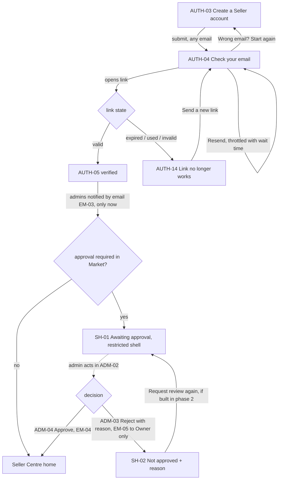
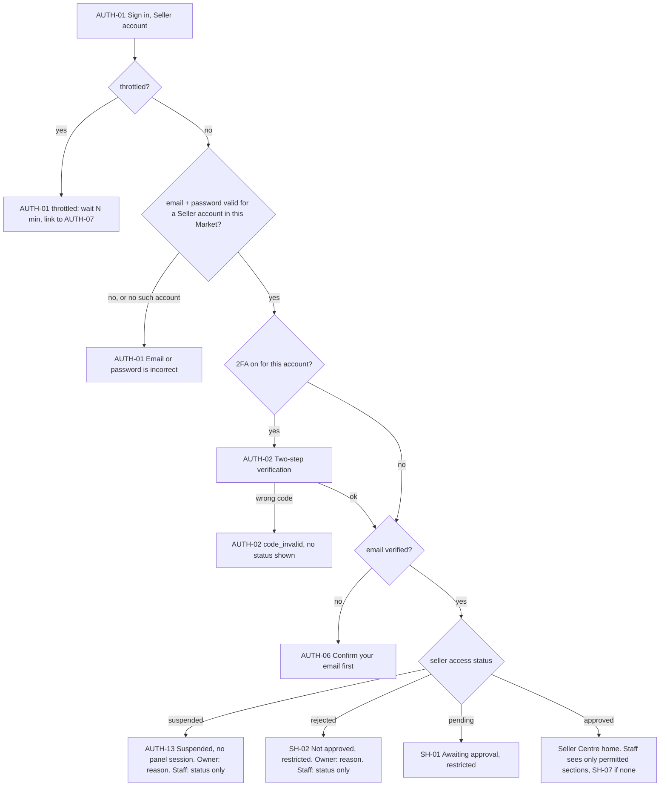
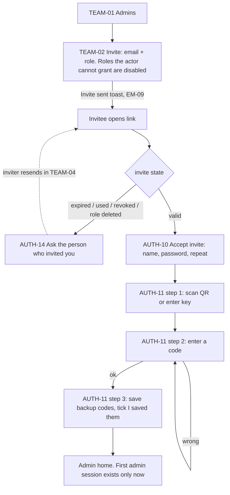
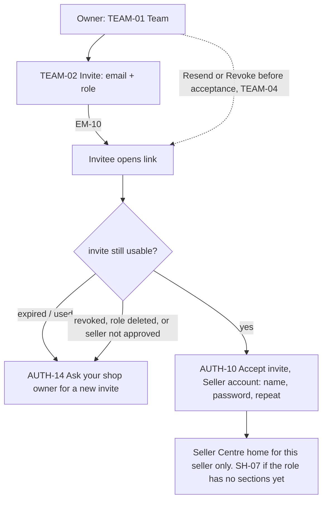
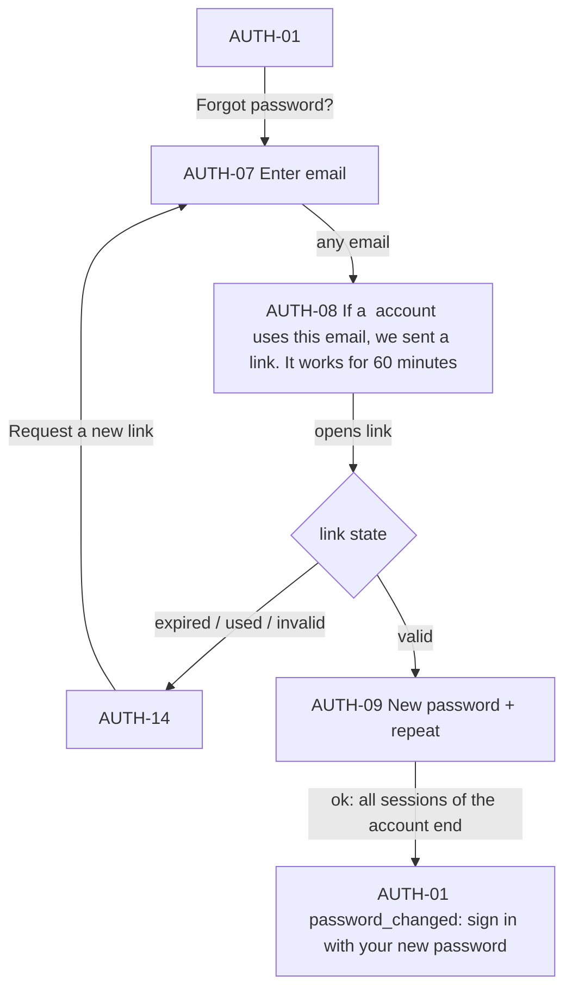
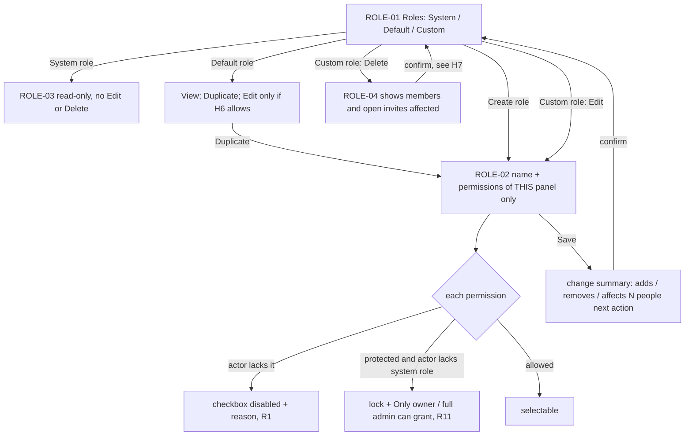
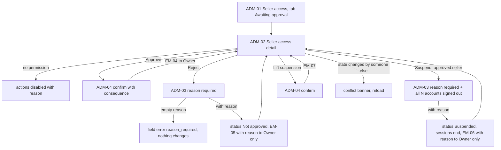

# identity: صفحه‌ها و جریان‌ها (G2)

| | |
|---|---|
| نویسنده | Reza (ui-ux-designer)، همراه با دید محصولی Jafar (product-designer) |
| وضعیت | پیشنهاد G2، ۳ اکتبر ۲۰۲۶. منتظر بازبینی تیم G2 |
| مبنا | `docs/modules/identity/brief.md` (G1 تأیید، ۲ اکتبر ۲۰۲۶)، بخش ۲، ۴، ۵، ۱۰، ۱۱ و ۱۲؛ ADR-0017؛ `docs/design/figma/README.md`؛ `docs/design/figma/update-procedure.md`؛ `docs/design/frontend-kickoff.md`؛ `docs/design/research/panels-ux-strategy.md` |
| اثر بر سیستم طراحی | جدول بخش ۱۲ برگه (همین G2 پر شده است) |

> این سند **رفتار و ساختار** صفحه‌ها را می‌گوید، نه ظاهر نهایی. ظاهر اول در Figma کشیده می‌شود (CLAUDE.md قاعدهٔ ۱۲). هیچ قاعدهٔ کسب‌وکاری تازه‌ای اینجا ساخته نشده است؛ هر جا مستندات چیزی نگفته‌اند، موضوع به بخش ۸ («موارد برای Hadi، Mohammad و Hassan») رفته است.
> متن‌های انگلیسی داخل این سند **الگو**اند، نه متن نهایی. متن نهایی با `design:ux-copy` و در فایل ترجمه نوشته می‌شود.

---

## ۱. تصمیم‌های طراحی این G2 (تیمی، برگشت‌پذیر؛ ADR-0013 تصمیم ۵)

| # | تصمیم | دلیل |
|---|---|---|
| U1 | همهٔ صفحه‌های پیش از ورود روی **یک قالب «Auth»** ساخته می‌شوند: کارت تک‌ستونه در وسط، اول برای عرض گوشی (۳۶۰px)، با سرصفحهٔ نشان MondaPac + نام پنل (`Admin` یا `Seller Centre`) + برچسب نوع حساب. قالب property `Workspace=Admin|Seller` دارد. | برگه بخش ۱۲؛ تصمیم ۵ (هر صفحه نوع حساب را نام می‌برد)؛ یک ساختار برای دو پنل (`frontend-kickoff.md`) |
| U2 | صفحه‌های پنل فروشنده (از جمله Auth فروشنده) روی دستگاه لمسی (`pointer: coarse`) با `data-density="touch"` نمایش داده می‌شوند: کنترل ۴۸px و متن Touch. پنل ادمین تراکم دسکتاپ دارد. | `panels-ux-strategy.md` اصل ۶؛ Staff روی تبلت پیشخوان وارد می‌شود |
| U3 | پیام‌ها فقط از **کد حالت** API ساخته می‌شوند؛ رابط هیچ متنی از سرور نشان نمی‌دهد، به‌جز **متن دلیل رد یا تعلیق** که دادهٔ کاربر است و به‌صورت متن ساده (بدون HTML و Markdown) نمایش داده می‌شود. | برگه بخش ۶ («شکل پاسخ‌ها»)؛ INTL-11 |
| U4 | نوع حساب در متن صفحه از **خودِ پنل** می‌آید، نه از پاسخ API. API هرگز نمی‌گوید حسابی وجود دارد یا نه. | تصمیم ۵؛ قاعدهٔ enumeration (بخش ۵ برگه) |
| U5 | فروشندهٔ «در انتظار تأیید» و «ردشده» داخل `AppShell` در **حالت محدود** است: منوی کناری فقط «Account status» و «Account security» دارد؛ جست‌وجو و اعلان در نوار بالا پنهان است؛ منوی کاربر (Account security، Sign out) می‌ماند. فروشندهٔ **معلق** نشست پنل ندارد و صفحه‌اش در قالب Auth است. | تصمیم ۶ و ۹؛ SEL-07؛ برگه بخش ۱۲ |
| U6 | فرم‌ها خطا را **کنار فیلد** و یک خلاصهٔ خطا بالای فرم نشان می‌دهند؛ فوکوس بعد از ارسال ناموفق به خلاصه می‌رود. خطای ورود (`invalid_credentials`) خطای فرم است، نه خطای یک فیلد، تا نگوید کدام فیلد اشتباه است. | WCAG 3.3.1 و 3.3.3؛ SEL-04 |
| U7 | ورودی کد (TOTP و کد پشتیبان) **یک فیلد** است، نه شش خانهٔ جدا: `inputmode="numeric"`، `autocomplete="one-time-code"`، پذیرش paste با فاصله یا خط تیره. | دسترس‌پذیری صفحه‌خوان، paste و پرکردن خودکار |
| U8 | هر اقدام حساس ادمین یا Seller Owner با **Dialog تأیید** انجام می‌شود که پیامد را می‌گوید. رد و تعلیق Dialog دلیل اجباری دارد. هیچ اقدام گروهی در این ماژول نیست. | `panels-ux-strategy.md` اصل ۵؛ تصمیم ۹؛ تأیید گروهی خارج از دامنه است (برگه بخش ۳) |
| U9 | اقدامی که کاربر مجوزش را ندارد ولی بخش را می‌بیند: **دکمهٔ غیرفعال با دلیل** (Tooltip و متن کمکی)، نه پنهان و نه 403 خام. بخشی که مجوز دیدنش را ندارد در منو نیست. صفحه‌ای که مستقیم باز شود: SH-05. | `panels-ux-strategy.md` بخش ۵ (قاعدهٔ مجوز در UI)؛ R1، R3، R11 |
| U10 | تا Figma به‌روز نشده و توکن‌ها Export نشده‌اند، هیچ برش UI شروع نمی‌شود. همهٔ صفحه‌های این سند در برش ۱۳ ساخته می‌شوند؛ ستون «برش API» می‌گوید هر صفحه از کدام برش به بعد قابل ساخت است. | ADR-0017 تصمیم ۶؛ برگه بخش ۱۱ ردیف ۱۳ |

---

## ۲. فهرست صفحه‌ها

**قرارداد شناسه:** `AUTH-*` قالب Auth (پیش از ورود یا بدون نشست پنل)؛ `SH-*` داخل `AppShell` برای هر دو پنل؛ `ADM-*` فقط پنل ادمین؛ `ROLE-*` و `TEAM-*` قالب‌های مشترک دو پنل. «D» یعنی Dialog روی صفحهٔ دیگر.
**حالت‌های عمومی هر صفحه** (در جدول تکرار نشده‌اند): loading (skeleton هم‌اندازه، بدون spinner صفحه)، خطای شبکه یا سرور (InfoBanner Critical با «Try again»، دادهٔ فرم حفظ می‌شود)، `market_unavailable` (Market میزبانی‌نشده یا نامشخص: صفحهٔ خطای عمومی، بدون فرم؛ AC 2).

### ۲.۱ قالب Auth (پیش از ورود)

| شناسه | پنل | هدف | حالت‌ها | ورود ← خروج | قابلیت / AC | برش API |
|---|---|---|---|---|---|---|
| AUTH-01 Sign in | Admin، Seller | ورود با ایمیل و رمز | default؛ submitting؛ `invalid_credentials` (پیام عمومی فرم)؛ `throttled` با زمان انتظار و لینک بازیابی رمز؛ `session_ended` (بنر اطلاع، یک پیام برای همهٔ دلیل‌ها)؛ `signed_out`؛ `password_changed` (بعد از بازیابی) | نشانی پنل، لینک ایمیل، پایان نشست ← AUTH-02، AUTH-06، AUTH-13، SH-01، SH-02، خانهٔ پنل | SEL-01، SEL-04؛ AC 1، 3، 7، 13، 20، 30 | ۲ (پایه)، ۵ (Seller)، ۷ (Admin) |
| AUTH-02 Two-step verification | Admin (همیشه)، Seller (اگر روشن کرده) | گرفتن کد اپ رمزساز یا کد پشتیبان | default؛ `code_invalid`؛ `throttled` با زمان انتظار؛ حالت «Use a backup code»؛ `backup_code_used` (بعد از ورود: بنر «N codes left»)؛ `challenge_expired` (برگشت به AUTH-01) | AUTH-01 ← مرحلهٔ وضعیت (نمودار ۳.۲) یا AUTH-12 | تصمیم ۷؛ AC 7، 10، 30 | ۷ (Admin)، ۱۲ (Seller) |
| AUTH-03 Create a Seller account | Seller | ثبت‌نام حساب فروشنده: نام، ایمیل، رمز، تکرار رمز | default؛ خطای اعتبارسنجی کنار فیلد (قالب ایمیل، سیاست رمز، نابرابری تکرار)؛ `throttled`؛ submitting | لینک «Create a Seller account» در AUTH-01 ← AUTH-04 (همیشه، چه ایمیل حساب داشته باشد چه نه) | SEL-01؛ AC 3، 21 | ۵ |
| AUTH-04 Check your email | Seller | تأیید ارسال، فرستادن دوباره، اصلاح نشانی | default (نشانی واردشده دیده می‌شود)؛ resend در حال انتظار با شمارش معکوس؛ `resent`؛ `throttled` | AUTH-03، AUTH-06 ← «Wrong email? Start again» به AUTH-03 با فرم پر؛ لینک ایمیل به AUTH-05 | برگه ۴-الف ۲؛ AC 21 | ۳، ۵ |
| AUTH-05 Email confirmation result | Seller | نتیجهٔ باز کردن لینک تأیید | `verified` ← «Sign in» (یا ادامه، اگر همان مرورگر نشست محدود دارد)؛ `already_verified`؛ `link_expired` / `link_used` / `link_invalid` ← AUTH-14 | لینک ایمیل ← AUTH-01 یا SH-01 | برگه ۴-الف ۳؛ AC 16، 19 | ۳ |
| AUTH-06 Confirm your email first | Seller | دروازهٔ «ایمیل تأیید نشده» بعد از ورود درست | default با resend؛ resend در حال انتظار؛ `throttled`؛ «Sign out» | AUTH-01/02 ← AUTH-04 | SEL-04؛ AC 16 | ۳، ۵ |
| AUTH-07 Forgot password | Admin، Seller | درخواست لینک بازیابی | default؛ خطای قالب ایمیل؛ `throttled` | AUTH-01، AUTH-14 ← AUTH-08 (همیشه) | SEL-05؛ AC 13، 21 | ۴ |
| AUTH-08 Reset link sent | Admin، Seller | پاسخ یکسان، با مدت اعتبار لینک | default؛ resend با شمارش معکوس | AUTH-07 ← لینک ایمیل به AUTH-09 | SEL-05؛ AC 21 | ۴ |
| AUTH-09 Set a new password | Admin، Seller | تعیین رمز تازه با لینک | default؛ خطای سیاست رمز و تکرار؛ `link_expired` / `link_used` / `link_invalid` ← AUTH-14؛ موفق ← AUTH-01 با `password_changed` (ورود خودکار نیست) | لینک ایمیل ← AUTH-01 | SEL-05؛ AC 8، 18، 19 | ۴ |
| AUTH-10 Accept invite | Admin (ادمین تازه)، Seller (فروشندهٔ ساختهٔ ادمین، Staff) | تعیین رمز (و نام) برای دعوت | default (ایمیل دعوت‌شده فقط‌خواندنی؛ نام پنل و نوع دعوت دیده می‌شود)؛ خطای سیاست رمز؛ `invite_expired`؛ `invite_used`؛ `invite_unusable` (لغوشده، نقش حذف‌شده، فروشندهٔ نه‌تأییدشده، نامعتبر؛ همه یک پیام) ← AUTH-14 | لینک دعوت ← Admin: AUTH-11؛ فروشندهٔ ساختهٔ ادمین: SH-01 (یا خانه اگر نیاز به تأیید خاموش است)؛ Staff: خانهٔ پنل (SH-07) | SEL-06، PNL-05، R12؛ AC 22، 29، 31، 37 | ۸ (Admin)، ۹ (فروشنده)، ۱۱ (Staff) |
| AUTH-11 Set up two-step verification (Admin) | Admin | راه‌اندازی اجباری اپ رمزساز: ۱) QR و کلید دستی ۲) تأیید با یک کد ۳) ذخیرهٔ کدهای پشتیبان | step 1/2/3؛ `code_invalid`؛ `setup_expired` (شروع دوباره)؛ گام ۳: «Continue» تا تیک «I've saved my backup codes» غیرفعال است | AUTH-10 یا اولین ورود ادمین بدون عامل دوم ← خانهٔ پنل ادمین (نشست فقط بعد از گام ۲ ساخته می‌شود) | `technical-spec.md` ۳.۱؛ AC 10، 22 | ۷ |
| AUTH-12 Lost your device? | Admin، Seller | توضیح راه بازیابی وقتی اپ و کد پشتیبان در دست نیست | متن ثابت؛ Admin: «Ask another admin with full access to reset it»؛ Seller: راهی که Hassan تعیین می‌کند (بخش ۸) | AUTH-02 ← AUTH-01 | تصمیم ۷؛ برگه بخش ۷ («بازنشانی برای فروشنده‌ای که گوشی‌اش گم شده») | ۷، ۱۲ |
| AUTH-13 Account suspended | Seller | وضعیت تعلیق بعد از احراز هویت کامل؛ نشست پنل ساخته نمی‌شود | Owner: وضعیت + متن دلیل؛ Staff: فقط وضعیت + «Contact your shop owner»؛ «Back to sign in» | AUTH-01/02 ← AUTH-01 | SEL-04، SEL-07، تصمیم ۹؛ AC 7، 14 | ۵ (پیام)، ۹ (تعلیق) |
| AUTH-14 Link no longer works | Admin، Seller | یک صفحه برای همهٔ لینک‌های منقضی، استفاده‌شده یا نامعتبر | variant بر اساس منظور: تأیید ایمیل («Send a new link» ← AUTH-04 / AUTH-01)؛ بازیابی رمز (← AUTH-07)؛ دعوت («Ask the person who invited you to send a new invite»؛ خود دعوت‌شده نمی‌تواند دعوت تازه بخواهد) | AUTH-05، AUTH-09، AUTH-10 ← همان مقصدها | AC 8، 19، 29، 37 | ۳، ۴، ۸ |

### ۲.۲ داخل AppShell (هر دو پنل)

| شناسه | پنل | هدف | حالت‌ها | ورود ← خروج | قابلیت / AC | برش API |
|---|---|---|---|---|---|---|
| SH-01 Account status: awaiting approval | Seller (حالت محدود، U5) | «در انتظار تأیید»: چه شده، بعد چه می‌شود | Owner و Staff یکسان؛ Badge Info «Awaiting approval»؛ «What happens next» (ایمیل نتیجه)؛ بعد از تأیید، درخواست بعدی به خانهٔ پنل می‌رود | AUTH-01/02/10 ← خانهٔ پنل بعد از تأیید | SEL-03، تصمیم ۶؛ AC 4 | ۵ |
| SH-02 Account status: not approved | Seller (حالت محدود) | وضعیت «رد شده» | Owner: Badge Critical «Not approved» + متن دلیل (U3) + «What you can do»؛ Staff: فقط وضعیت + «Contact your shop owner»؛ دکمهٔ «Request review again» فقط اگر عمل درخواست دوباره در فاز ۲ ساخته شود (بخش ۸، H3)؛ `reapply_limit_reached` | AUTH-01/02 ← SH-01 بعد از درخواست دوباره | تصمیم ۹؛ AC 6 | ۹ |
| SH-03 Account security | Admin، Seller (در حالت محدود هم، اگر در فهرست مجاز باشد؛ بخش ۸، M3) | تغییر رمز؛ وضعیت عامل دوم؛ کدهای پشتیبان | تغییر رمز: رمز فعلی، تازه، تکرار؛ `current_password_invalid`؛ موفق: Toast «Password changed. Other devices were signed out» (یا AUTH-01 اگر نشست جاری هم پایان یابد؛ Hassan)؛ عامل دوم Seller: Off ← «Turn on» (SH-04) / On ← «Turn off» (Dialog با کد) و «New backup codes» (Dialog با کد)؛ عامل دوم Admin: همیشه On، خاموش‌شدنی نیست | منوی کاربر ← همین صفحه | برگه ۴-ج؛ تصمیم ۷؛ AC 32 | ۴، ۷، ۱۲ |
| SH-04 Turn on two-step verification | Seller | همان سه گام AUTH-11، داخل پوسته | مثل AUTH-11؛ به‌علاوهٔ «Cancel» | SH-03 ← SH-03 با Toast | تصمیم ۷؛ AC 30 | ۱۲ |
| SH-05 You don't have access | Admin، Seller | صفحه‌ای که مجوز دیدنش نیست (باز شدن مستقیم نشانی) | متن: «Ask your shop owner» یا «Ask an admin with full access»؛ دکمهٔ «Go to Home»؛ هیچ اشاره‌ای به وجود یا نبود منبع | هر صفحه ← خانه | ADM-05، PNL-05؛ AC 9، 15 | ۸ |
| SH-06 Session ending (D) | Admin، Seller | هشدار پیش از پایان نشست | «You'll be signed out in 2 min» با «Stay signed in» (اگر نشست قابل تمدید است) و «Sign out»؛ اعلام با `aria-live="assertive"` یک بار | هر صفحه ← همان صفحه یا AUTH-01 (`session_ended`) | WCAG 2.2.1؛ تصمیم ۳ | ۲ |
| SH-07 Staff home (empty) | Seller (Staff) | خانهٔ Staff وقتی هنوز هیچ بخشی برای نقشش نیست | EmptyState: «Nothing to do here yet» + نام نقش + «Your shop owner controls what you can see»؛ منو فقط بخش‌های مجاز | AUTH-01/10 ← — | PNL-05؛ برگه بخش ۳ (پیامد فهرست مجوزهای کوچک) | ۱۱ |

### ۲.۳ فقط پنل ادمین

| شناسه | پنل | هدف | حالت‌ها | ورود ← خروج | قابلیت / AC | برش API |
|---|---|---|---|---|---|---|
| ADM-01 Seller access | Admin | فهرست سادهٔ دسترسی فروشنده‌ها (قالب Index، بدون اقدام گروهی و بدون KPI)؛ تب‌ها: Awaiting approval (پیش‌فرض)، Not approved، Suspended، All | empty برای هر تب («Nothing waiting. You're up to date.»)؛ loading (۸ ردیف skeleton)؛ ستون‌ها: نام، ایمیل Owner، وضعیت (Badge)، ایمیل تأییدشده در، تاریخ ثبت‌نام؛ دکمهٔ «Create seller» (بدون مجوز: غیرفعال با دلیل) | منوی «Seller access» با CountBadge انتظار ← ADM-02 | SEL-03، SEL-07؛ برگه بخش ۳ («شکل صفحهٔ سادهٔ آن در G2») | ۹ |
| ADM-02 Seller access detail | Admin | دیدن یک فروشنده و تصمیم | سرصفحه با Badge وضعیت؛ تاریخچهٔ وضعیت (TimelineItem: چه کسی، کی، کدام اقدام، دلیل)؛ اقدام‌ها بر اساس وضعیت: Awaiting ← Approve، Reject؛ Approved ← Suspend؛ Suspended ← Lift suspension؛ Not approved ← فقط دیدن؛ بدون مجوز: دکمهٔ غیرفعال با دلیل (AC 9)؛ `conflict` (وضعیت را کس دیگری عوض کرده: بنر + بارگذاری دوباره) | ADM-01 ← ADM-03، ADM-04 | SEL-03، SEL-07، تصمیم ۹؛ AC 4، 6، 9، 14 | ۹ |
| ADM-03 Reject / Suspend (D) | Admin | ثبت دلیل اجباری | Textarea اجباری با شمارندهٔ حروف؛ متن کمکی «The seller owner sees this text in an email and when they sign in. Don't include internal notes.»؛ دکمهٔ اصلی Destructive تا دلیل خالی است غیرفعال نیست ولی ارسال خالی خطای کنار فیلد می‌دهد؛ `reason_required`، `reason_too_long`؛ پیامد صریح: «All N accounts of this seller are signed out» (تعلیق) | ADM-02 ← ADM-02 با Toast | تصمیم ۹؛ AC 6، 14 | ۹ |
| ADM-04 Approve / Lift suspension (D) | Admin | تأیید بدون دلیل، با بیان پیامد | «The seller can use Seller Centre from their next sign-in. We'll email the shop owner.» | ADM-02 ← ADM-02 با Toast | SEL-02، SEL-03، SEL-07؛ AC 4، 14 | ۹ |
| ADM-05 Create seller (D) | Admin | ساخت فروشنده با دعوت‌نامه: نام و ایمیل؛ بدون فیلد رمز | خطای قالب؛ متن کمکی «We'll email an invite. They set their own password.»؛ اگر نیاز به تأیید روشن است: «They'll start as awaiting approval»؛ نتیجه برای ایمیلی که حساب Seller دارد: بخش ۸، S4 | ADM-01 ← ADM-01 با Toast «Invite sent» | SEL-06؛ AC 5، 31 | ۹ |
| ADM-06 Customer account | Admin | پیدا کردن حساب مشتری با ایمیل کامل و غیرفعال کردن آن | جست‌وجوی دقیق (نه بخشی)؛ `not_found`؛ نتیجه: وضعیت، تاریخ ساخت؛ «Deactivate» با Dialog پیامد («Signs them out everywhere»)؛ بدون مجوز: غیرفعال با دلیل | منو ← همین صفحه | برگه ۴-ه ۸؛ AC 11، 18 | تعیین نشده (بخش ۸، H5) |

### ۲.۴ قالب‌های مشترک نقش و تیم (Admin و Seller)

نام بخش در منو: Admin ← «Roles & permissions» (زیر Settings) با دو تب «Admins» و «Roles»؛ Seller ← «Team & roles» (زیر Shop settings) با دو تب «Team» و «Roles». هر دو روی یک قالب‌اند؛ تفاوت فقط در فهرست مجوزها، متن‌ها و اقدام «Deactivate» (ادمین) در برابر «Remove from team» (فروشنده).

| شناسه | پنل | هدف | حالت‌ها | ورود ← خروج | قابلیت / AC | برش API |
|---|---|---|---|---|---|---|
| TEAM-01 Members | Admin، Seller | اعضا و دعوت‌های باز | ستون‌ها: نام و ایمیل، نقش، وضعیت (Active، Invited، Invite expired، Deactivated)؛ ردیف خودِ کاربر: «You»، بدون اقدام روی نقش خود (R1)؛ ردیف آخرین Owner یا آخرین ادمین کامل: اقدام‌ها غیرفعال با دلیل (R3)؛ ردیف عضوی که مجوز بیشتری دارد: غیرفعال با دلیل (R1)؛ empty: «Only you so far. Invite your team.»؛ Staff فروشنده این صفحه را نمی‌بیند (فاز ۲) | منو ← TEAM-02..05، ROLE-01 | ADM-05، PNL-05؛ R1، R3، R11؛ AC 23، 25، 33، 35 | ۸ (Admin)، ۱۱ (Seller) |
| TEAM-02 Invite (D) | Admin، Seller | دعوت با ایمیل و نقش | Select نقش فقط نقش‌هایی را فعال نشان می‌دهد که کاربر می‌تواند بدهد؛ بقیه غیرفعال با دلیل («Includes permissions you don't have»؛ «Only the shop owner / full admin can give this role»)؛ پاسخ همیشه Toast «Invite sent to …» (بخش ۸، M6)؛ `invite_not_allowed` | TEAM-01 ← TEAM-01 | R1، R11، R12؛ AC 29، 35، 37 | ۸، ۱۱ |
| TEAM-03 Change role (D) | Admin، Seller | عوض کردن نقش یک عضو | مثل TEAM-02؛ پیامد: «Takes effect on their next action»؛ `last_owner` / `last_full_admin` | TEAM-01 ← TEAM-01 با Toast | R1، R3، R4؛ AC 25، 26، 34 | ۸، ۱۱ |
| TEAM-04 Remove / Deactivate / Revoke invite / Resend invite (D) | Admin، Seller | برداشتن عضو، غیرفعال کردن ادمین، لغو یا ارسال دوبارهٔ دعوت | Remove و Deactivate: Destructive با پیامد «They're signed out now»؛ Revoke: «The link stops working»؛ Resend: بدون Dialog، Toast، و دکمه در حال شمارش معکوس اگر `throttled` | TEAM-01 ← TEAM-01 | R3، R4، R12؛ AC 18، 25، 27 | ۸، ۱۱ |
| TEAM-05 Reset two-step verification (D) | Admin | بازنشانی عامل دوم ادمین دیگر | فقط برای دارندهٔ نقش سیستمی ادمین فعال است (R11)؛ پیامد: «They'll set it up again at next sign-in and are signed out now» | TEAM-01 ← TEAM-01 | R1، R11؛ AC 11، 18، 33 | ۸ |
| ROLE-01 Roles | Admin، Seller | فهرست نقش‌ها در سه گروه: System، Default، Custom | ستون‌ها: نام، نوع (Badge)، تعداد اعضا، تعداد مجوز؛ «Create role» (فقط برای کسی که می‌تواند)؛ empty گروه Custom: «No custom roles yet»؛ Default: «View» و «Duplicate» (و Edit فقط اگر H6 آن را مجاز کند) | TEAM-01 (تب) ← ROLE-02، ROLE-03، ROLE-04 | تصمیم ۸ و ۸b؛ R2، R3، R9، R10 | ۸ (فهرست)، ۱۰ (Custom) |
| ROLE-02 Create / edit role | Admin، Seller | نام نقش و انتخاب مجوز از فهرست مجوزهای **همان پنل** | مجوزها گروه‌بندی‌شده بر اساس بخش (هر گروه: سرگروه + Checkboxها با توضیح)؛ مجوزی که کاربر ندارد: Checkbox غیرفعال با دلیل (R1)؛ مجوز محافظت‌شده: آیکن قفل و «Only <system role> can grant this» (R11)؛ خلاصهٔ «N permissions selected»؛ هنگام ویرایش، خلاصهٔ تغییرها قبل از ذخیره («Adds 2, removes 1. Affects N people on their next action.»)؛ `name_taken`، `name_required`، `role_limit_reached`؛ ترک صفحه با تغییر ذخیره‌نشده: Dialog | ROLE-01 ← ROLE-01 با Toast | ADM-05، PNL-05؛ R1، R2، R4، R10، R11؛ AC 23، 24، 35، 36 | ۱۰، ۱۱ |
| ROLE-03 System role (read-only) | Admin، Seller | نمایش نقش سیستمی | InfoBanner Info: «This role always has every permission in this panel and can't be edited or deleted»؛ فهرست مجوزها همه تیک‌خورده و غیرفعال؛ هیچ دکمهٔ Edit یا Delete | ROLE-01 ← ROLE-01 | R3؛ AC 25 | ۸ |
| ROLE-04 Delete role (D) | Admin، Seller | حذف نقش Custom | پیامد: تعداد اعضا و دعوت‌های باز این نقش («Open invites with this role stop working»)؛ رفتار وقتی نقش عضو دارد: بخش ۸، H7 | ROLE-01 / ROLE-02 ← ROLE-01 با Toast | R3، R5، R12؛ AC 25، 37 | ۱۰، ۱۱ |

**جمع:** ۳۶ صفحه و Dialog: AUTH ۱۴، SH ۷، ADM ۶، TEAM ۵، ROLE ۴ (یک ردیف «TEAM-04» چهار اقدام کوچک را با یک Dialog پوشش می‌دهد).

---

## ۳. جریان‌ها

نمودارها شناسهٔ صفحه‌های بخش ۲ را دارند. برچسب‌ها انگلیسی‌اند تا در Mermaid با متن فارسی جابه‌جا نشوند.

### ۳.۱ ثبت‌نام فروشنده ← تأیید ایمیل ← انتظار ← تأیید یا رد (برگه ۴-الف)

### ۳.۲ ورود فروشنده و Staff با پیام وضعیت و عامل دوم (برگه ۴-ب، قاعدهٔ SEL-04)

قاعده: **هیچ پیام وضعیت یا دلیلی پیش از احراز هویت کامل نشان داده نمی‌شود.** هر شکستی پیش از آن یک پیام دارد: `invalid_credentials`. ترتیب بررسی بعد از رمز درست را Mohammad قطعی می‌کند (بخش ۸، M4)؛ پیشنهاد ما: عامل دوم، بعد ایمیل، بعد وضعیت فروشنده.

### ۳.۳ دعوت ادمین ← تعیین رمز ← راه‌اندازی TOTP (برگه ۴-ه ۲ و ۳)

ورود بعدی ادمین: AUTH-01 ← AUTH-02 (همیشه) ← خانه. ادمینی که عامل دومش بازنشانی شده (TEAM-05): AUTH-01 ← AUTH-11 ← خانه.

### ۳.۴ پذیرش دعوت Staff (برگه ۴-و، R12)

پیام «فروشنده تأییدشده نیست» به دعوت‌شده گفته نمی‌شود؛ همان پیام عمومی `invite_unusable` (وضعیت فروشنده فقط بعد از احراز هویت کامل گفته می‌شود).

### ۳.۵ بازیابی رمز (برگه ۴-ج؛ برای Admin و Seller یکسان)

### ۳.۶ ویرایشگر نقش: ساخت، ویرایش و حذف؛ نقش سیستمی فقط‌خواندنی (تصمیم ۸ و ۸b)

### ۳.۷ تأیید، رد، تعلیق و رفع تعلیق با Dialog دلیل اجباری (برگه ۴-ه ۵)

---

## ۴. قواعد پیام‌ها

### ۴.۱ کد حالت به‌جای متن

- API فقط **کد حالت** (و پارامترهای بی‌نام مثل `retry_after_seconds`) برمی‌گرداند. رابط متن را از **کلید ترجمه** می‌سازد. نام نهایی کدها را Mohammad در طراحی API قطعی می‌کند؛ فهرست لازم برای رابط:
  `invalid_credentials`، `throttled` (+`retry_after_seconds`)، `second_factor_required`، `code_invalid`، `challenge_expired`، `email_unverified`، `seller_pending`، `seller_rejected` (+ متن دلیل فقط برای Owner)، `seller_suspended` (+ متن دلیل فقط برای Owner)، `session_ended`، `link_expired`، `link_used`، `link_invalid`، `invite_expired`، `invite_used`، `invite_unusable`، `permission_denied`، `last_owner`، `last_full_admin`، `reason_required`، `reason_too_long`، `name_taken`، `role_limit_reached`، `reapply_limit_reached`، `conflict`، `market_unavailable`، `validation` (+ کد هر فیلد).
- الگوی کلید: `identity.<screen>.<element>`، مثل `identity.signIn.error.invalidCredentials`. پارامترها با ICU (`{minutes, plural, one {# minute} other {# minutes}}`). نوع حساب پارامتر `{accountType}` است که از خود پنل می‌آید (U4).
- **زبان:** در شروع فقط `en-AU` با املای استرالیایی؛ هیچ متن ثابتی در کد. چیدمان با ویژگی‌های منطقی (`inline-start/end`) تا RTL آماده بماند (STO-13). متن‌ها ۴۰٪ جای بلندتر دارند.
- **زمان انتظار:** از `retry_after_seconds` به دقیقهٔ رو به بالا گرد می‌شود («Try again in 3 minutes»)، هر ۶۰ ثانیه به‌روز می‌شود (مثل قاعدهٔ شمارش در `frontend-kickoff.md` بخش ۷) و فقط پایانش با `aria-live="polite"` اعلام می‌شود. دکمه تا پایان غیرفعال است.

### ۴.۲ نام بردن نوع حساب (تصمیم ۵، AC 3)

- هر صفحهٔ Auth، بالای عنوان، برچسب نوع حساب دارد: «Seller account» یا «Admin account»؛ و عنوان هم آن را تکرار می‌کند: «Sign in to your Seller account».
- AUTH-01 Seller یک خط کمکی دارد: «This sign-in is for Seller accounts. Shopping on MondaPac uses a separate Customer account.» (الگو). هیچ لینکی به ورود مشتری نیست تا ویترین طراحی شود.
- هر ایمیل در موضوع و خط اول نوع حساب را دارد (بخش ۶).

### ۴.۳ پیام عمومی ورود

- تنها پیام شکست پیش از احراز هویت کامل: «Email or password is incorrect.» (الگو). همین پیام برای ایمیل ناموجود، رمز نادرست، حساب نوع دیگر، Market دیگر و حساب غیرفعال.
- پیام عمومی خطای فرم است (U6) و فوکوس به آن می‌رود؛ فیلد رمز پاک می‌شود و فیلد ایمیل می‌ماند.
- `session_ended`: یک پیام برای همهٔ دلیل‌ها (انقضا، تعلیق، تغییر رمز، برداشتن از تیم): «You've been signed out. Sign in to continue.» دلیل تعلیق فقط بعد از ورود دوباره و احراز هویت کامل دیده می‌شود.

### ۴.۴ الگوی تأیید ایمن در برابر enumeration (ثبت‌نام و بازیابی؛ AC 21)

متن نهایی تبلیغاتی اینجا نوشته نمی‌شود؛ فقط الگو:

1. **صفحه یکسان است:** پاسخ برای ایمیل تازه و ایمیل دارای حساب، در محتوا، طول و زمان یکی است. صفحه نشانی واردشده را نشان می‌دهد تا خطای تایپ دیده شود.
2. **شرطی گفتن، نه قطعی:** «If a Seller account can be created / exists for {email}, we've sent you an email.» هرگز «We've created your account» یا «No account found».
3. **گام بعد روشن:** چه ایمیلی بیاید، تا کی معتبر است (بازیابی: ۶۰ دقیقه، SEL-05)، پوشهٔ spam، و «Resend» با شمارش معکوس.
4. **تفاوت فقط در خود ایمیل است:** ایمیل تازه لینک تأیید دارد؛ اگر حساب از قبل هست، ایمیل «someone tried to create a Seller account with your email» با لینک ورود و بازیابی می‌رود (EM-02). اگر حساب نیست، ایمیل بازیابی فرستاده نمی‌شود (یا ایمیل «no Seller account» با تصمیم Hassan؛ بخش ۸، S6).
5. **اصلاح نشانی:** «Wrong email? Start again» فقط فرم را دوباره باز می‌کند و چیزی دربارهٔ حساب قبلی نمی‌گوید.

### ۴.۵ دلیل رد و تعلیق

- فقط Seller Owner متن دلیل را می‌بیند (SH-02، AUTH-13، EM-05، EM-06). Staff فقط وضعیت و «Contact your shop owner».
- دلیل متن سادهٔ کاربر است: داخل یک بلوک نقل‌قول جدا با برچسب «Reason from MondaPac»، بدون تفسیر HTML یا لینک خودکار، با شکستن خط امن.

---

## ۵. دسترس‌پذیری و لمس (WCAG 2.2 AA)

| موضوع | قاعده |
|---|---|
| ساختار | هر صفحهٔ Auth یک `h1`، `main` و skip link دارد؛ عنوان سند (`<title>`) نوع حساب و گام را می‌گوید (WCAG 2.4.2). |
| برچسب | هر فیلد برچسب دیدنی دارد (placeholder جای برچسب نیست)؛ متن کمکی و خطا با `aria-describedby` وصل است؛ خطا با آیکن و متن، نه فقط رنگ (1.4.1، 3.3.1). |
| autocomplete | `email`، `current-password`، `new-password`، `one-time-code`، `name` (1.3.5). مدیر رمز کار می‌کند؛ **paste در هیچ فیلدی مسدود نمی‌شود** (3.3.8 احراز هویت در دسترس). |
| فیلد رمز | دکمهٔ Show/Hide داخل فیلد: IconButton با `aria-pressed` و برچسب «Show password»/«Hide password»؛ فوکوس در فیلد می‌ماند. سیاست رمز **قبل از تایپ** زیر فیلد دیده می‌شود. با Show، فیلد تکرار هم نمایش داده می‌شود. فیلد «تکرار رمز» طبق SEL-01 می‌ماند. |
| ورودی کد | یک فیلد (U7)، فونت Mono، `inputmode="numeric"` برای TOTP؛ کد پشتیبان `inputmode="text"`؛ فاصله، خط تیره و حروف کوچک/بزرگ نرمال می‌شوند؛ ارسال خودکار با رسیدن به ۶ رقم **ندارد** (کاربر دکمه را می‌زند؛ 3.2.2). |
| کدهای پشتیبان | فهرست در `<ol>` با Mono، دکمه‌های Copy all، Download (.txt) و Print؛ اعلام «Copied» با `aria-live="polite"`؛ هیچ کدی در نشانی یا عنوان صفحه نیست. |
| QR | `alt` توصیفی + کلید دستی گروه‌بندی‌شده (چهارحرفی) با دکمهٔ Copy، برای کسی که نمی‌تواند QR را اسکن کند. |
| Dialog | `role="dialog"`، `aria-modal`، فوکوس اول روی اولین فیلد یا دکمهٔ امن (Cancel برای Destructive)؛ Esc می‌بندد؛ فوکوس به دکمهٔ بازکننده برمی‌گردد؛ در Destructive دکمهٔ اصلی متن صریح دارد («Suspend seller»، نه «OK»). |
| Toast | `role="status"`؛ دست‌کم ۶ ثانیه و با hover/فوکوس متوقف؛ هیچ اطلاعات لازم فقط در Toast نیست (پیامد در صفحه هم دیده می‌شود). |
| مجوز غیرفعال | کنترل غیرفعال با `aria-disabled` (نه `disabled`) تا فوکوس بگیرد و دلیل با `aria-describedby` خوانده شود. |
| زمان | SH-06 دست‌کم ۲ دقیقه پیش از پایان نشست هشدار می‌دهد (2.2.1)؛ شمارش معکوس throttle با `aria-live` پرسروصدا نیست. |
| هدف لمسی | Seller روی لمسی: کنترل‌ها و دکمهٔ Show/Hide ۴۸px (`--mp-size-control` زیر `data-density="touch"`)؛ Admin دسکتاپ: حداقل ۳۲px (2.5.8 حداقل ۲۴). فاصلهٔ بین دکمه‌های Dialog دست‌کم `space-2`. |
| کنتراست | فقط توکن‌های موجود؛ متن ≥ 4.5:1، مرز فیلد ≥ 3:1 (`border-input`). |
| حرکت | بدون انیمیشن غیرضروری؛ `prefers-reduced-motion` رعایت می‌شود. |
| CAPTCHA | در این طراحی هیچ آزمون شناختی نیست (3.3.8). اگر Hassan برای ضد سوءاستفاده چیزی بخواهد، باید جایگزین در دسترس داشته باشد. |

---

## ۶. قالب‌های ایمیل

همه بیرون از Figma پنل‌اند (بخش ۱۲ برگه). قواعد مشترک: موضوع و خط اول **نوع حساب** را دارند؛ همهٔ متن‌ها کلید ترجمه‌اند (`identity.email.<template>.<part>`)؛ زمان به منطقهٔ گیرنده (ADR-0005 تصمیم ۳)؛ لینک‌ها نشانی پایهٔ قابل تنظیم دارند و توکن در بخشی از نشانی است که لاگ نمی‌شود (Mohammad و Hassan)؛ هیچ ایمیلی رمز یا کد TOTP ندارد؛ نسخهٔ متنی ساده کنار HTML.

| شناسه | ایمیل | گیرنده | نوع حساب | دلیل دارد؟ | AC |
|---|---|---|---|---|---|
| EM-01 | Confirm your email (لینک تأیید) | فروشندهٔ تازه | Seller | — | 16، 19 |
| EM-02 | Someone tried to create an account with your email | صاحب حساب موجود (ثبت‌نام تکراری) | Seller | — | 21 |
| EM-03 | New seller waiting for approval | ادمین‌های دارای مجوز تأیید در همان Market (بخش ۸، H8)؛ فقط بعد از تأیید ایمیل فروشنده؛ بدون نام یا ایمیل فروشنده در موضوع | Admin | — | 16 |
| EM-04 | Welcome / your Seller account is approved | Seller Owner | Seller | — | 4 |
| EM-05 | Your Seller account was not approved | **فقط Seller Owner** | Seller | بله | 6 |
| EM-06 | Your Seller account is suspended | **فقط Seller Owner** | Seller | بله | 14 |
| EM-07 | Your Seller account suspension is lifted | Seller Owner | Seller | — | 14 |
| EM-08 | Reset your password (۶۰ دقیقه) | صاحب حساب | Admin یا Seller | — | 8 |
| EM-09 | You're invited to MondaPac Admin | ادمین تازه | Admin | — | 22 |
| EM-10 | You're invited to join <shop> on Seller Centre | Staff | Seller | — | 29 |
| EM-11 | Set up your Seller account (فروشندهٔ ساختهٔ ادمین) | Seller Owner | Seller | — | 31 |
| EM-12 | Your password was changed | صاحب حساب (بعد از بازیابی یا تغییر) | Admin یا Seller | — | 8، 32 |
| EM-13 | Two-step verification turned on / off / reset | صاحب حساب | Admin یا Seller | — | 11 |

- **Staff هیچ ایمیلی با دلیل نمی‌گیرد** (برگه بخش ۵). اگر بعداً به Staff دربارهٔ تعلیق خبر داده شود، فقط وضعیت را دارد.
- خوش‌آمد SEL-02 («ایمیل خوش‌آمد بعد از تأیید ایمیل») و ایمیل نتیجهٔ تأیید: اگر نیاز به تأیید روشن است، EM-04 دو نسخه دارد: «Email confirmed, we're reviewing your account» بعد از تأیید ایمیل، و «Approved» بعد از تصمیم. EM-12 و EM-13 در برگه نام برده نشده‌اند؛ پیشنهاد تیم‌اند (بخش ۸، H9).

---

## ۷. صفحه‌های مشتری

**بیرون از این طراحی.** ویترین هنوز جهت طراحی ندارد و سیستم طراحی فعلی فقط پنل‌های Admin و Seller را پوشش می‌دهد (ADR-0017؛ برگه بخش ۳ و ۸). در فاز ۲ برای مشتری فقط API و تست ساخته می‌شود (برگه ۴-د). قواعد بخش ۴ (کد حالت، نام بردن نوع حساب، پیام عمومی، الگوی enumeration) و بخش ۵ برای صفحه‌های مشتری هم الزامی خواهند بود؛ وقتی طراحی ویترین شروع شود، جریان‌های مشتری یک مرور کوچک می‌گیرند (ADR-0013 تصمیم ۴). تنها صفحهٔ مرتبط با مشتری در این سند ADM-06 (پنل ادمین) است.

---

## ۸. سؤال‌های باز

### ۸.۱ تصمیم‌های صاحب پروژه

**هیچ.** همهٔ موارد زیر فنی یا برگشت‌پذیرند و تیم تصمیم می‌گیرد (ADR-0013 تصمیم ۵). اگر Hadi در H1 یا H3 فکر کند پاسخ قاعدهٔ کسب‌وکار تازه است، آن را به صاحب پروژه می‌برد.

### ۸.۲ برای Hadi (product-owner)

| # | موضوع | پیشنهاد Reza و Jafar |
|---|---|---|
| H1 | «نام» در SEL-01: نام شخص یا نام کسب‌وکار؟ برچسب AUTH-03 و ستون ADM-01 به آن وابسته است | نام شخص («Your name»)؛ نام فروشگاه با `sellers` در فاز ۳ |
| H2 | فهرست نقش‌های پیش‌فرض (برگه بخش ۷) | محتوای Select در TEAM-02 و گروه Default در ROLE-01 از آن می‌آید |
| H3 | «درخواست دوباره» در فاز ۲ یا با `sellers` در فاز ۳ | اگر فاز ۳: SH-02 بدون دکمه و با متن «You'll be able to update your details and ask for another review» |
| H4 | دعوت‌شده (ادمین تازه و Staff) هنگام پذیرش نام خودش را وارد می‌کند؟ | بله، در AUTH-10؛ دعوت‌کننده فقط ایمیل و نقش می‌دهد (برگه ۴-ه ۲) |
| H5 | ADM-06 (غیرفعال کردن مشتری، برگه ۴-ه ۸ و AC 11) در فهرست صفحه‌های بخش ۱۲ و جدول برش‌ها نیست | یک صفحهٔ سادهٔ جست‌وجوی دقیق؛ API در برش ۸ کنار غیرفعال کردن ادمین |
| H6 | فروشنده نقش پیش‌فرض را ویرایش می‌کند یا فقط کپی می‌گیرد (برگه بخش ۷) | فقط Duplicate (با R9 و R10 ساده‌تر می‌خواند) |
| H7 | تکلیف کسانی که نقششان حذف می‌شود (برگه بخش ۷) | حذف نقشِ دارای عضو مسدود است تا اعضا نقش دیگری بگیرند؛ ROLE-04 تعداد و فهرست را نشان می‌دهد |
| H8 | گیرندگان EM-03 | همهٔ ادمین‌های دارای مجوز تأیید فروشنده در همان Market |
| H9 | EM-12 و EM-13 (اطلاع تغییر رمز و عامل دوم) | اضافه شوند؛ هزینه کم، و صاحب حساب از تغییر ناخواسته خبردار می‌شود |

### ۸.۳ برای Mohammad (software-architect)

| # | موضوع |
|---|---|
| M1 | نام نهایی کدهای حالت بخش ۴.۱ و پارامتر `retry_after_seconds` در پاسخ throttle |
| M2 | ADM-01 فهرستی از دادهٔ خودِ `identity` است (نام، ایمیل Owner، وضعیت، تاریخ‌ها) تا فهرست فروشنده‌های `sellers` (SEL-14) در فاز ۳ جایش را بگیرد؛ با رمزنگاری ایمیل، جست‌وجو فقط با ایمیل کامل ممکن است (ADM-06 هم) |
| M3 | فهرست مجاز فروشندهٔ در انتظار و ردشده: پیشنهاد ما صفحهٔ وضعیت، Account security (تغییر رمز، عامل دوم) و Sign out |
| M4 | ترتیب بررسی بعد از رمز درست (نمودار ۳.۲): عامل دوم، ایمیل، وضعیت فروشنده |
| M5 | حساب تأییدنشده‌ای که با «Start again» رها می‌شود: پاک‌سازی یا انقضا |
| M6 | دعوت ایمیلی که از قبل حساب نوع فروشنده دارد (برگه بخش ۷): پاسخ TEAM-02 همیشه «Invite sent» است و نتیجه فقط در ایمیل و هنگام پذیرش معلوم می‌شود |
| M7 | فهرست مجوزها باید برای هر مجوز کلید ترجمهٔ نام و توضیح، گروه (بخش)، و پرچم «محافظت‌شده» بدهد تا ROLE-02 بدون متن ثابت ساخته شود |
| M8 | حداکثر طول متن دلیل (ADM-03) و حداکثر طول نام نقش (ROLE-02) |

### ۸.۴ برای Hassan (security-tester)

| # | موضوع |
|---|---|
| S1 | نشست قابل تمدید است یا سقف مطلق دارد؟ SH-06 «Stay signed in» فقط برای نشست قابل تمدید؛ سقف مطلق باید در WCAG 2.2.1 به‌عنوان «essential» توجیه شود |
| S2 | بعد از تغییر رمز، نشست جاری می‌ماند؟ (SH-03؛ برگه ۴-ج) |
| S3 | خاموش کردن عامل دوم فروشنده و ساخت کدهای پشتیبان تازه کد فعلی می‌خواهد؟ (پیشنهاد: بله) |
| S4 | ADM-05 برای ایمیلی که حساب Seller دارد چه می‌گوید؟ (ادمین احراز هویت کامل و مجوز دارد؛ پیشنهاد: پیام صریح «A Seller account already uses this email») |
| S5 | راه بازنشانی عامل دوم فروشنده‌ای که گوشی‌اش گم شده: چه کسی، از کدام صفحه (AUTH-12)؛ ADM-02 جای طبیعی آن است ولی ویرایش تیم توسط ادمین خارج از دامنه است |
| S6 | ایمیل بازیابی برای ایمیلی که حساب ندارد: هیچ ایمیل، یا ایمیل «no Seller account» |
| S7 | آستانه‌های throttle برای دکمه‌های Resend (AUTH-04، AUTH-08، TEAM-04) |

---

## ۹. اثر بر ADR

ندارد. این سند با ADR-0017 (Figma اول) و ADR-0018 (نشست سمت سرور، مجوز در لایهٔ application) هم‌خوان است و فقط آن‌ها را در سطح صفحه اجرا می‌کند.

## ۱۰. گام بعد برای سیستم طراحی

۱. باز کردن خودِ فایل Figma و تطبیق جدول بخش ۱۲ برگه با آن (این جدول از README و کد افزونه ساخته شده، نه از فایل).
۲. ساخت پیشنهادها در Sandbox (`Proposal · <component> · identity`) با همهٔ حالت‌ها، هر دو تم و Touch برای Seller.
۳. بازبینی Reza و Jafar، دسترس‌پذیری با Sajad، Audit بدون هشدار، انتشار ۱.۱.۰، Export توکن‌ها.
۴. فقط بعد از آن برش ۱۳ شروع می‌شود (CLAUDE.md قاعدهٔ ۱۲).
